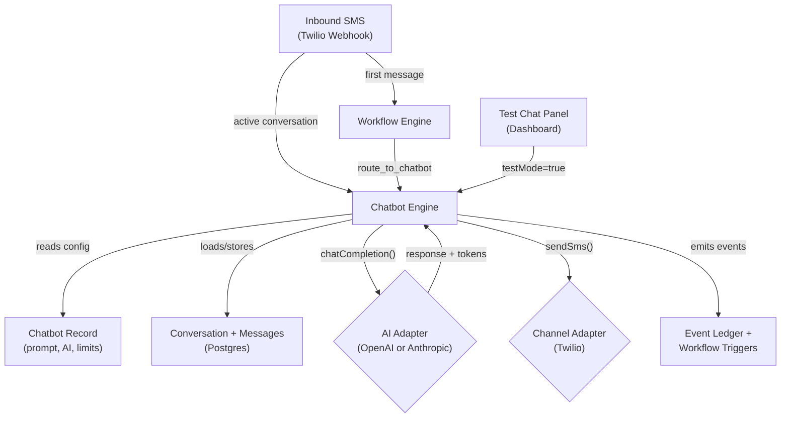

# AI Chatbot System

> **Last Updated:** March 4, 2026
> **Status:** Core System Complete, Feature Expansion In Progress
> **Phases:** Twilio Adapter, OpenAI Adapter, Anthropic Adapter, Chatbot Engine, Test Suite

## Executive Summary

The AI chatbot system enables autonomous conversational AI agents within RevLine workspaces. Each workspace can create multiple chatbots that respond to leads via SMS (Twilio) using AI (OpenAI or Anthropic). The system is **channel-agnostic** and **AI-agnostic** by design -- the chatbot engine doesn't know or care which messaging provider or AI model it's using. Everything is configured per-bot.

The system integrates bidirectionally with the workflow engine: workflows can activate bots (`route_to_chatbot` action), and bots emit events that trigger other workflows (`conversation_started`, `escalation_requested`, etc.).

---

## Architecture



### Message Flow

1. **First message from a new contact:** Twilio webhook fires `sms_received` trigger into the workflow engine. A workflow with a `route_to_chatbot` action creates the conversation and generates the first AI response.
2. **Subsequent messages in an active conversation:** Twilio webhook detects an active conversation for the contact+number combo and routes directly to the chatbot engine, bypassing workflow overhead.
3. **Test mode:** The test chat panel in the dashboard calls the engine with `testMode=true`, which skips channel delivery (no SMS sent) but exercises the full pipeline.

---

## Components

### Phase 1: Twilio Adapter

**Status:** Complete

The Twilio adapter handles SMS sending/receiving, webhook signature validation, and phone number management.

| File | Purpose |
|------|---------|
| `app/_lib/integrations/twilio.adapter.ts` | SMS adapter (sendSms, verifyWebhook, phone number management) |
| `app/api/v1/twilio-webhook/route.ts` | Inbound SMS webhook handler with chatbot routing |
| `app/_lib/workflow/executors/twilio.ts` | Workflow executor for `send_sms` action |
| `app/(dashboard)/workspaces/[id]/twilio-config-editor.tsx` | Structured config UI (phone numbers, webhook setup) |

**Capabilities:**
- Send SMS via Twilio REST API
- Receive inbound SMS via webhook (form-urlencoded)
- Validate `X-Twilio-Signature` using the `twilio` SDK
- Phone number management (add/remove via API fetch from Twilio account)
- Webhook deduplication via `MessageSid`
- Active conversation detection for direct chatbot routing

**Secrets:** Account SID, Auth Token

---

### Phase 2a: OpenAI Adapter

**Status:** Complete

| File | Purpose |
|------|---------|
| `app/_lib/integrations/openai.adapter.ts` | Chat Completions API adapter |
| `app/_lib/workflow/executors/openai.ts` | Workflow executor for `generate_text` action |
| `app/(dashboard)/workspaces/[id]/openai-config-editor.tsx` | Structured config UI (model, temperature, max tokens) |
| `app/api/v1/integrations/[id]/openai-models/route.ts` | Fetch available models from OpenAI API |

**Capabilities:**
- Chat completions via `client.chat.completions.create()`
- Model listing via `client.models.list()`
- Tool/function calling support (`tools` parameter)
- Token usage tracking (prompt + completion)

**Models supported:** gpt-4.1, gpt-4.1-mini, gpt-4.1-nano, gpt-4o, gpt-4o-mini

**Secret:** API Key

---

### Phase 2b: Anthropic Adapter

**Status:** Complete

| File | Purpose |
|------|---------|
| `app/_lib/integrations/anthropic.adapter.ts` | Messages API adapter |
| `app/_lib/workflow/executors/anthropic.ts` | Workflow executor for `generate_text` action |
| `app/(dashboard)/workspaces/[id]/anthropic-config-editor.tsx` | Structured config UI (model, max tokens, temperature) |
| `app/api/v1/integrations/[id]/anthropic-models/route.ts` | Fetch available models from Anthropic API |

**Capabilities:**
- Chat completions via `client.messages.create()`
- Translates between RevLine's unified `ChatMessage` format and Anthropic's format (system prompt as top-level param, `developer` role mapped to `system`)
- Tool use support (`tool_use` / `tool_result` content blocks)
- Token usage tracking (input + output)
- `max_tokens` is required on every Anthropic call (handled by adapter)

**Models supported:** claude-opus-4-6, claude-sonnet-4-6, claude-haiku-4-5-20251001

**Secret:** API Key

---

### Phase 3a: Chatbot Engine Core

**Status:** Complete

The chatbot engine manages the full conversational loop autonomously.

#### Engine

| File | Purpose |
|------|---------|
| `app/_lib/chatbot/engine.ts` | Core engine: `handleInboundMessage()` |
| `app/_lib/chatbot/types.ts` | Type definitions (InboundMessageParams, ChatbotResponse, etc.) |
| `app/_lib/chatbot/index.ts` | Barrel exports |
| `app/_lib/chatbot/pricing.ts` | Static model pricing map for cost estimation |

**Engine flow (per turn):**

1. Load chatbot config from DB
2. Find or create conversation for contact+channel+bot
3. Check guardrails: timeout, message limit, token limit
4. Store inbound USER message
5. Emit `conversation_started` event (if new)
6. Load full conversation history
7. Build AI messages (system prompt + history)
8. Call AI adapter (OpenAI or Anthropic based on config)
9. Store ASSISTANT response with token usage
10. Update conversation counters (messageCount, totalTokens)
11. Send reply via channel adapter (Twilio) -- skipped in test mode
12. Emit events (`chatbot_response_sent`, `chatbot_turn_complete`)
13. Return `ChatbotResponse` with usage, events, latency

**Guardrails:**
- Max messages per conversation (default 50)
- Max tokens per conversation (default 100,000)
- Conversation timeout (default 24 hours)
- Fallback message on AI failure
- Allowed events whitelist

#### Database Models

In `prisma/schema.prisma`:

**Chatbot** -- Workspace-scoped bot configuration:
- Identity: name, description
- Channel: channelType (SMS), channelIntegration (TWILIO)
- AI: aiIntegration (OPENAI/ANTHROPIC), modelOverride, temperatureOverride, maxTokensOverride
- Prompt: systemPrompt (text)
- Guardrails: maxMessagesPerConversation, maxTokensPerConversation, conversationTimeoutMinutes, fallbackMessage
- Permissions: allowedEvents (JSON array of event types the bot can emit)
- Status: active toggle

**Conversation** -- Ties a lead + bot + channel:
- Channel context: contactAddress, channelAddress, channel
- Status: ACTIVE, COMPLETED, ESCALATED, TIMED_OUT
- Counters: messageCount, totalTokens
- Flags: isTest (separates test conversations from production)
- Timestamps: startedAt, lastMessageAt, endedAt

**ConversationMessage** -- Individual messages:
- Role: USER, ASSISTANT, SYSTEM
- Content: message text
- Token tracking: promptTokens, completionTokens

#### CRUD API

| Route | Methods | Purpose |
|-------|---------|---------|
| `/api/v1/workspaces/[id]/chatbots` | GET, POST | List/create chatbots |
| `/api/v1/workspaces/[id]/chatbots/[chatbotId]` | GET, PATCH, DELETE | Get/update/delete chatbot |
| `/api/v1/workspaces/[id]/chatbots/[chatbotId]/conversations` | GET | List production conversations |

#### Dashboard UI

| File | Purpose |
|------|---------|
| `app/(dashboard)/workspaces/[id]/chatbot-list.tsx` | Chatbot list with status, conversation count, create/edit/delete |
| `app/(dashboard)/workspaces/[id]/chatbot-editor.tsx` | Structured config editor for all chatbot settings |

Accessible via the **Chatbots** tab in the workspace sidebar.

---

### Phase 3b: Workflow Integration

**Status:** Complete

The chatbot plugs into the workflow system as an internal adapter (like RevLine forms).

**Registered in `app/_lib/workflow/registry.ts`:**

| Type | Name | Description |
|------|------|-------------|
| Trigger | `conversation_started` | New conversation created |
| Trigger | `escalation_requested` | Bot needs human help |
| Trigger | `conversation_completed` | Conversation ended (limit, timeout, or goal) |
| Trigger | `bot_event` | Generic event from allowedEvents config |
| Action | `route_to_chatbot` | Activate a chatbot for a lead/channel |

**Executor:** `app/_lib/workflow/executors/chatbot.ts` -- Reads chatbotId from action params, forwards trigger payload to `handleInboundMessage()`.

**Styling:** `app/_lib/workflow/integration-config.ts` -- Violet brand color (`#8B5CF6`), Bot icon.

---

### Phase 4: Test Suite

**Status:** Complete

A full chat playground built into the Testing tab for real AI testing without burning Twilio SMS credits.

| File | Purpose |
|------|---------|
| `app/(dashboard)/workspaces/[id]/testing-chat-panel.tsx` | Full chat playground UI |
| `app/(dashboard)/workspaces/[id]/testing-tab.tsx` | Testing tab (Endpoints, Scenarios, **Chats**) |
| `app/api/v1/workspaces/[id]/chatbots/[chatbotId]/test-chat/route.ts` | POST: send test message, GET: list test convos, DELETE: clear |
| `app/api/v1/workspaces/[id]/chatbots/[chatbotId]/test-trigger/route.ts` | POST: simulate workflow trigger |
| `app/_lib/chatbot/pricing.ts` | Cost estimation for known models |

**Test Chat Features:**
- Chatbot selector (active bots only)
- Real AI calls (actual OpenAI/Anthropic API)
- No channel delivery (testMode skips Twilio)
- Inline metadata per response: token counts, cost estimate, latency, events emitted
- Collapsible system prompt editor with live overrides
- Guardrail progress bars (messages + tokens vs limits)
- Quick-send buttons (escalation, appointment, gibberish, goodbye)
- Trigger simulator with configurable payload
- Conversation history browser
- New chat / clear all actions
- Test conversations flagged `isTest=true`, excluded from production stats

**Cost Estimation:**
Static pricing map for all supported models. Returns dollar amounts for prompt + completion tokens.

---

## Production Data Isolation

Test conversations are completely isolated from production:
- `Conversation.isTest` boolean field distinguishes test from real
- Chatbot list API excludes `isTest=true` from conversation counts
- Individual chatbot detail API excludes test conversations
- Conversations list API filters `isTest: false` by default
- Test chat GET endpoint only returns `isTest: true` conversations

---

## Configuration Summary

### Per-Workspace Setup

Each workspace needs:
1. **Twilio integration** -- Account SID + Auth Token secrets, phone numbers configured
2. **AI integration** -- OpenAI or Anthropic API Key secret, model + temperature configured
3. **Chatbot(s)** -- Created in the Chatbots tab with channel, AI provider, system prompt, and guardrails

### Twilio Webhook Setup

The inbound SMS webhook URL format:
```
https://your-domain.com/api/v1/twilio-webhook?source={workspaceSlug}
```
Configure in Twilio Console: Phone Numbers > Your Number > Messaging > "A message comes in" > Webhook > HTTP POST.

---

## Event Emission

The chatbot system emits these events into the event ledger:

| Event | When |
|-------|------|
| `chatbot_conversation_started` | New conversation created |
| `chatbot_conversation_completed` | Conversation ended (timeout, message limit, token limit) |
| `chatbot_escalation_requested` | Bot escalated to human |
| `chatbot_response_sent` | AI response delivered |
| `chatbot_ai_failure` | AI adapter call failed |
| `chatbot_bot_event` | Generic event from allowedEvents |

---

## File Index

### New Files (25)

**Core Engine (4):**
- `app/_lib/chatbot/engine.ts`
- `app/_lib/chatbot/types.ts`
- `app/_lib/chatbot/index.ts`
- `app/_lib/chatbot/pricing.ts`

**Integration Adapters (3):**
- `app/_lib/integrations/twilio.adapter.ts`
- `app/_lib/integrations/openai.adapter.ts`
- `app/_lib/integrations/anthropic.adapter.ts`

**Webhook Handler (1):**
- `app/api/v1/twilio-webhook/route.ts`

**API Routes (7):**
- `app/api/v1/workspaces/[id]/chatbots/route.ts`
- `app/api/v1/workspaces/[id]/chatbots/[chatbotId]/route.ts`
- `app/api/v1/workspaces/[id]/chatbots/[chatbotId]/conversations/route.ts`
- `app/api/v1/workspaces/[id]/chatbots/[chatbotId]/test-chat/route.ts`
- `app/api/v1/workspaces/[id]/chatbots/[chatbotId]/test-trigger/route.ts`
- `app/api/v1/integrations/[id]/openai-models/route.ts`
- `app/api/v1/integrations/[id]/anthropic-models/route.ts`

**Workflow Executors (4):**
- `app/_lib/workflow/executors/twilio.ts`
- `app/_lib/workflow/executors/openai.ts`
- `app/_lib/workflow/executors/anthropic.ts`
- `app/_lib/workflow/executors/chatbot.ts`

**Dashboard UI (6):**
- `app/(dashboard)/workspaces/[id]/chatbot-list.tsx`
- `app/(dashboard)/workspaces/[id]/chatbot-editor.tsx`
- `app/(dashboard)/workspaces/[id]/testing-chat-panel.tsx`
- `app/(dashboard)/workspaces/[id]/twilio-config-editor.tsx`
- `app/(dashboard)/workspaces/[id]/openai-config-editor.tsx`
- `app/(dashboard)/workspaces/[id]/anthropic-config-editor.tsx`

### Modified Files (10+)

- `prisma/schema.prisma` -- Chatbot, Conversation, ConversationMessage models + enums
- `app/_lib/types/index.ts` -- TwilioMeta, OpenAIMeta, AnthropicMeta types
- `app/_lib/integrations/config.ts` -- TWILIO, OPENAI, ANTHROPIC integration configs
- `app/_lib/integrations/index.ts` -- Barrel exports for new adapters
- `app/_lib/workflow/registry.ts` -- Twilio, OpenAI, Anthropic, Chatbot adapter definitions
- `app/_lib/workflow/executors/index.ts` -- Executor registration
- `app/_lib/workflow/integration-config.ts` -- Visual styling for new adapters
- `app/(dashboard)/workspaces/[id]/workspace-tabs.tsx` -- Chatbots tab
- `app/(dashboard)/workspaces/[id]/testing-tab.tsx` -- Chats sub-tab
- `app/(dashboard)/_components/sidebar/WorkspaceNav.tsx` -- Chatbots nav item
- `app/(dashboard)/workspaces/[id]/integration-actions.tsx` -- Wire-up for new integrations

### Dependencies Added

- `twilio` -- SMS sending and webhook signature validation
- `openai` -- Chat Completions API client
- `@anthropic-ai/sdk` -- Messages API client

---

## 3/4/2026 — Feature Audit & Next Steps

### Current Status by Category

#### Done (3)

- **Multi-turn conversation history** — Full message history is loaded from the DB and passed to the AI on every turn. Not just the latest message.
- **Workspace-level chatbot isolation** — Every query is scoped by workspaceId. Bots, conversations, messages never bleed between clients.
- **Escalation event emission** — Bot emits `escalation_requested` which can trigger workflows.

#### Partial (4)

- **Bot sleep / human takeover** — `ESCALATED` status stops the bot, but there is no `PAUSED` status, no auto-resume on inactivity, and no way for a human to manually pause a specific conversation from the dashboard.
- **Escalation delivery** — The event fires and *can* trigger a workflow (e.g., email the gym owner), but there is no built-in notification and no conversation summary is generated for the human taking over.
- **Per-conversation log** — API exists (`GET /chatbots/[id]/conversations`) with full messages, but no dashboard UI to view production conversations. Test playground shows test convos only.
- **Per-client usage tracking** — Token counts are stored per-conversation and per-message. No aggregation view, no dashboard surface, no billing hooks.

#### Missing (13)

**Core Config:**
- **Response delay** — Bot replies instantly. Need a configurable delay (e.g., 2-5 seconds) to prevent robotic feel.
- **Initial message** — No dedicated first-message field. The bot only responds to inbound; it never initiates contact.
- **FAQ override layer** — Every message hits the AI. Need keyword/pattern matching that bypasses AI for hardcoded answers (hours, location, pricing).
- **Make channel config optional** — Currently required to create a bot. Should be optional so bots can be created and tested without Twilio configured. Channel only required when used in a workflow.

**Conversation Quality:**
- **Opt-out handling** — No STOP/UNSUBSCRIBE detection, no blocking of future messages, no dashboard surfacing. This is a compliance risk.
- **Rate limiting per lead** — No per-lead throttle. A lead spamming messages gets unlimited AI responses up to the guardrail max.

**Follow-up Sequencing (biggest gap):**
- **Re-engagement triggers** — No timed follow-ups. The engine only reacts to inbound messages, never proactively sends. Need scheduled follow-ups at configurable intervals (e.g., 2hr / 12hr / 23hr within the 24hr SMS window).
- **Follow-up rotation** — No variant cycling. Needs to send different follow-up messages each time, never the same one twice.
- **Last-question-aware follow-up** — No context-aware follow-up generation. Follow-ups should reference the last thing discussed.

**Escalation:**
- **Handoff summary** — No summary generation on escalation. The human taking over has to read the raw conversation.

**Analytics / Visibility:**
- **Conversation dropoff chart** — No analytics on where leads ghost in the flow.
- **Lead pipeline view** — No visual funnel/stage view for gym owners to see their lead funnel.
- **Usage-based billing hooks** — Usage data is tracked but not aggregated or surfaced for billing.

---

### Implementation Roadmap

#### Priority 1 — Core Polish (before real testing)

These are needed to actually test the system end-to-end with real leads:

1. **Make channel config optional on chatbot** — Remove channel as required field, validate only at workflow-binding time
2. **Response delay** — Add `responseDelaySeconds` field to Chatbot model and engine, apply before `sendReply`
3. **Initial message** — Add `initialMessage` field; when a new conversation starts via `route_to_chatbot`, send this before waiting for lead input
4. **Opt-out handling** — Detect STOP/UNSUBSCRIBE in inbound messages, mark conversation as completed, block future messages to that contact, surface in dashboard

#### Priority 2 — Production Readiness

These are needed before deploying to real gym clients:

5. **Bot pause / human takeover** — Add `PAUSED` conversation status, dashboard button to pause per-conversation, auto-resume after configurable inactivity
6. **Escalation delivery** — Built-in email/SMS notification to gym owner on escalation, with AI-generated conversation summary
7. **FAQ override layer** — JSON array of `{ patterns: string[], response: string }` checked before AI call; exact matches bypass the model entirely
8. **Rate limiting per lead** — Cap responses per contact per time window (e.g., max 10 replies per hour)

#### Priority 3 — Follow-up Sequencing

Architecturally significant — requires a scheduler/cron mechanism:

9. **Re-engagement scheduler** — Cron job or delayed-action system that checks for conversations with no reply after configurable intervals, fires follow-up
10. **Follow-up variants** — Configurable array of follow-up message templates, cycled through per conversation
11. **Context-aware follow-up** — Generate follow-up via AI using last conversation context instead of generic template

#### Priority 4 — Visibility & Analytics

12. **Production conversation viewer** — Dashboard UI to browse and read real (non-test) conversations per chatbot and per lead
13. **Conversation history on lead detail** — Show past conversations on a lead's profile page
14. **Per-workspace usage dashboard** — Aggregated view: messages sent, tokens used, leads touched, estimated cost, broken out by chatbot
15. **Conversation analytics** — Dropoff chart, response time distribution, escalation rate, completion rate
16. **Lead pipeline view** — Visual stage funnel for gym owners

#### Priority 5 — Scale & Billing

17. **Usage-based billing hooks** — Aggregate usage per workspace per billing period, expose via API for billing integration
18. **Handoff summary** — AI-generated conversation summary on escalation

#### Future (unchanged)

- Tool calling / function calling — Bots calling workflow actions mid-conversation
- Web chat widget — Browser-based chat channel (beyond SMS)
- Multi-channel — WhatsApp, email, web chat channels
- Intent detection — Structured intent/goal tracking

---

## Standards Compliance

Audited against `docs/STANDARDS.md` and `docs/workflows/PRE-PUSH.md`:

- **Abstraction First:** All external calls through adapter layer
- **Workspace Isolation:** All queries scoped by workspaceId
- **Event-Driven Debugging:** Events emitted for all state changes
- **Fail-Safe Defaults:** Fallback messages on AI failure, graceful error handling
- **TypeScript:** No `any` types, explicit interfaces
- **Authentication:** All routes verify session + workspace access
- **No secrets in logs:** Verified across all files
- **Input validation:** Request bodies validated before processing
