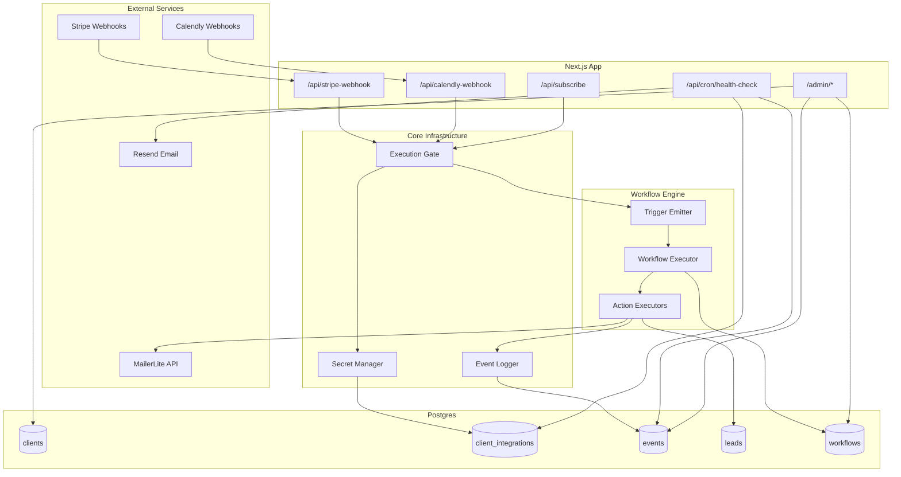

# Architecture

How the RevOps MVP system works under the hood.

---

## System Overview



> **Note:** The Workflow Engine is the central automation layer. All triggers (webhooks, email captures) emit events that the engine matches against configured workflows. See [Workflow Engine Documentation](./WORKFLOW-ENGINE.md) for details.

---

## Database Schema

### Tables

**`clients`** - Your paying clients
- `id` (uuid, primary key)
- `name` (text) - Display name
- `slug` (text, unique) - Used in `?source=` routing
- `status` (ACTIVE | PAUSED) - Controls execution gating
- `timezone` (text, optional)
- `created_at` (timestamp)

**`client_integrations`** - Per-client encrypted secrets
- `id` (uuid, primary key)
- `client_id` (foreign key)
- `integration` (MAILERLITE | STRIPE | CALENDLY | MANYCHAT)
- `encrypted_secret` (text) - AES-256-GCM encrypted
- `meta` (jsonb) - Non-sensitive config (group IDs, product maps)
- `health_status` (GREEN | YELLOW | RED)
- `last_seen_at` (timestamp) - Last successful API call
- `created_at` (timestamp)
- Unique constraint: `(client_id, integration)`

**`leads`** - Ops state tracking (NOT a CRM)
- `id` (uuid, primary key)
- `client_id` (foreign key)
- `email` (text)
- `source` (text) - e.g., "landing", "ig_dm"
- `stage` (CAPTURED | BOOKED | PAID | DEAD)
- `error_state` (text, nullable)
- `created_at` (timestamp)
- `last_event_at` (timestamp) - For stuck lead detection

**`events`** - Append-only event ledger
- `id` (uuid, primary key)
- `client_id` (foreign key)
- `lead_id` (foreign key, nullable)
- `system` (BACKEND | MAILERLITE | STRIPE | CALENDLY | MANYCHAT | CRON)
- `event_type` (text) - e.g., "email_captured", "mailerlite_subscribe_success"
- `success` (boolean)
- `error_message` (text, nullable)
- `created_at` (timestamp)
- Indexes: `(client_id, created_at)`, `(success, created_at)`

**`admins`** - Single admin account
- `id` (uuid, primary key)
- `password_hash` (text) - Argon2id hash
- `totp_secret` (text, nullable) - Encrypted TOTP secret for 2FA
- `totp_key_version` (int) - Key version used to encrypt TOTP secret
- `totp_enabled` (boolean) - Whether 2FA is enabled
- `recovery_codes` (jsonb, nullable) - Hashed recovery codes
- `created_at` (timestamp)

**`admin_sessions`** - Admin login sessions
- `id` (uuid, primary key) - Session ID stored in cookie
- `admin_id` (foreign key)
- `expires_at` (timestamp)
- `created_at` (timestamp)

**`workflows`** - Configurable automation workflows
- `id` (uuid, primary key)
- `client_id` (foreign key)
- `name` (text) - Display name
- `description` (text, nullable) - Optional description
- `enabled` (boolean) - Whether workflow is active
- `trigger_adapter` (text) - e.g., "calendly", "stripe"
- `trigger_operation` (text) - e.g., "booking_created"
- `trigger_filter` (jsonb, nullable) - Filter conditions
- `actions` (jsonb) - Array of action definitions
- `created_at` (timestamp)
- `updated_at` (timestamp)
- Index: `(client_id, trigger_adapter, trigger_operation)`

**`workflow_executions`** - Execution history and audit trail
- `id` (uuid, primary key)
- `workflow_id` (foreign key)
- `client_id` (foreign key)
- `trigger_adapter` (text)
- `trigger_operation` (text)
- `trigger_payload` (jsonb) - Full trigger data
- `status` (RUNNING | COMPLETED | FAILED)
- `action_results` (jsonb, nullable) - Array of action outcomes
- `error` (text, nullable)
- `started_at` (timestamp)
- `completed_at` (timestamp, nullable)
- Indexes: `(client_id, started_at)`, `(workflow_id, started_at)`

---

## Core Components

### 1. Secret Management (`app/_lib/crypto.ts`)

**What we store per ClientIntegration:**
- `encrypted_secret` (string): Base64-encoded blob of `IV || ciphertext || auth_tag`
- `key_version` (int, default 0): Which master key was used for this secret
- `meta` (JSON): Non-sensitive config only (group IDs, product maps). All sensitive data in `encrypted_secret`.

**Encryption model:**
- Algorithm: AES-256-GCM (256-bit key)
- IV: 12 bytes random per encryption
- Auth tag: 16 bytes (128 bits) appended for integrity
- Format: `encrypted_secret = base64(IV || ciphertext || auth_tag)`

**Keyring:**
```typescript
const KEYRING: Record<number, Buffer> = {
  0: Buffer.from(process.env.SRB_ENCRYPTION_KEY!, "hex"),     // Legacy
  1: Buffer.from(process.env.REVLINE_ENCRYPTION_KEY_V1!, "hex"), // Current
  // 2: Buffer.from(process.env.REVLINE_ENCRYPTION_KEY_V2!, "hex"), // Future
};
const CURRENT_KEY_VERSION = 1;
```

**Encrypt flow:**
1. Always uses `CURRENT_KEY_VERSION` and corresponding key
2. Returns `{ encryptedSecret, keyVersion }`
3. Both values stored in database

**Decrypt flow:**
1. Read `keyVersion` from database row
2. Look up `KEYRING[keyVersion]`
3. If version not found: hard failure with clear error
4. Decrypt using that key

**Where secrets are used:**
- Decrypted only at point-of-use inside backend adapters
- Never sent to frontend, never logged, never in API responses
- Not shown in admin UI (except confirmation that secret exists)

**Key rotation plan (built-in, not live yet):**
1. Generate new key: `openssl rand -hex 32`
2. Add to env: `REVLINE_ENCRYPTION_KEY_V2=<new key>`
3. Update code: add to KEYRING, set `CURRENT_KEY_VERSION = 2`
4. Deploy: new secrets use V2, old secrets still decrypt via V1
5. Migration: background job re-encrypts V1 → V2
6. Cleanup: remove V1 from keyring and env after migration complete

### 2. Event Logging (`app/_lib/event-logger.ts`)

**What gets logged:**
- ✅ State transitions: `email_captured`, `mailerlite_subscribe_success`
- ✅ Integration outcomes: `stripe_payment_succeeded`, `mailerlite_subscribe_failed`
- ✅ Execution blocks: `execution_blocked`, `client_paused`
- ✅ Health changes: `health_status_changed`

**What does NOT get logged:**
- ❌ HTTP request/response details
- ❌ Full payloads
- ❌ Intermediate API attempts
- ❌ Debug-level information

**Why:** The events table is your primary debugging surface. Keep it signal, not noise.

### 3. Execution Gating (`app/_lib/client-gate.ts`)

**Flow:**
1. Request arrives with `?source=clientslug`
2. Look up client by slug
3. Check `client.status === 'ACTIVE'`
4. If PAUSED: emit `execution_blocked` event, return error
5. If ACTIVE: proceed with automation

**Use case:** Instant non-payment handling. Click "Pause" in admin UI → all webhooks/forms blocked.

### 4. Workflow Engine (`app/_lib/workflow/`)

The workflow engine is the central automation layer that connects triggers to actions.

**Key Components:**

| File | Purpose |
|------|---------|
| `types.ts` | TypeScript interfaces for workflows, contexts, results |
| `registry.ts` | Adapter definitions (triggers & actions) |
| `engine.ts` | Core execution logic |
| `executors/` | Action executor implementations |

**How it works:**

1. **Trigger Emission:** Webhook handlers call `emitTrigger()` with event data
2. **Workflow Matching:** Engine finds all enabled workflows for this trigger
3. **Filter Evaluation:** Optional filter conditions checked against payload
4. **Action Execution:** Actions run sequentially; stops on first error
5. **Result Recording:** Execution logged to `workflow_executions` table

**Available Adapters:**

| Adapter | Triggers | Actions |
|---------|----------|---------|
| `calendly` | booking_created, booking_canceled | — |
| `stripe` | payment_succeeded, subscription_created | — |
| `mailerlite` | — | add_to_group, remove_from_group, add_tag |
| `revline` | email_captured | create_lead, update_lead_stage, emit_event |

**Example workflow:**
```json
{
  "triggerAdapter": "stripe",
  "triggerOperation": "payment_succeeded",
  "triggerFilter": { "product": "coaching" },
  "actions": [
    { "adapter": "revline", "operation": "update_lead_stage", "params": { "stage": "PAID" } },
    { "adapter": "mailerlite", "operation": "add_to_group", "params": { "group": "customers" } }
  ]
}
```

**For full details:** See [Workflow Engine Documentation](./WORKFLOW-ENGINE.md)

### 5. Integration Manager (`app/_lib/integrations.ts`)

**Functions:**
- `getClientSecret(clientId, integration)` - Fetch + decrypt secret
- `getClientIntegration(clientId, integration)` - Get secret + meta
- `touchIntegration(clientId, integration)` - Update `last_seen_at` and set health to GREEN
- `markIntegrationUnhealthy(clientId, integration, status)` - Set YELLOW or RED

**Meta examples:**

**Important:** Meta is stored as plain JSON (not encrypted) and visible in admin UI. Only store non-sensitive configuration here. All secrets/API keys go in the encrypted_secret field.

MailerLite:
```json
{
  "groupIds": {
    "lead": "123456",
    "customer": "789012",
    "customer_premium": "345678"
  }
}
```

Stripe:
```json
{
  "productMap": {
    "price_abc": "premium_offer"
  }
}
```

Note: Stripe meta is rarely needed since webhook handler uses MailerLite groups. Can be empty `{}` or contain optional product routing.

Calendly (optional):
```json
{
  "schedulingUrls": {
    "discovery": "https://calendly.com/yourname/30min",
    "strategy": "https://calendly.com/yourname/60min"
  },
  "addToBookedSegment": false
}
```

Note: Webhook signing key is stored in encrypted_secret field, not in meta.

---

## API Routes

### Public Routes (Used by Clients)

**`POST /api/subscribe?source={slug}`**
- Email capture from landing pages
- Flow:
  1. Look up client by slug
  2. Check if active (execution gate)
  3. Get MailerLite integration config
  4. Create/update lead record
  5. Emit `email_captured` event
  6. Call MailerLite API to add subscriber
  7. Emit `mailerlite_subscribe_success/failed` event
  8. Touch integration (update `last_seen_at`)

**`POST /api/stripe-webhook?source={slug}`**
- Payment webhooks from Stripe
- Flow:
  1. Look up client by slug
  2. Check if active (execution gate)
  3. Get Stripe integration (webhook secret)
  4. Verify signature
  5. Touch Stripe integration
  6. If event = `checkout.session.completed`:
     - Extract customer email
     - Create/update lead, set stage to PAID
     - Emit `stripe_payment_succeeded` event
     - Get MailerLite integration
     - Add customer to MailerLite group
     - Emit `mailerlite_subscribe_success/failed` event
     - Touch MailerLite integration

**`POST /api/calendly-webhook`**
- Booking webhooks from Calendly
- Flow:
  1. Extract client from `utm_source` in payload
  2. Look up client by slug
  3. Check if active (execution gate)
  4. Get Calendly integration (signing key)
  5. Verify HMAC SHA256 signature
  6. Touch Calendly integration
  7. If event = `invitee.created`:
     - Extract invitee email
     - Create/update lead, set stage to BOOKED
     - Emit `calendly_booking_created` event
  8. If event = `invitee.canceled`:
     - Revert lead stage to CAPTURED
     - Emit `calendly_booking_canceled` event

### Admin Routes (Internal Only)

**`POST /api/admin/login`**
- Verify password against Argon2 hash
- Create session in `admin_sessions`
- Set httpOnly cookie with session ID

**`POST /api/admin/logout`**
- Delete session from `admin_sessions`
- Clear cookie

**`GET /api/admin/clients`**
- List all clients with health indicators
- Client health = worst health among all integrations

**`GET /api/admin/clients/[id]`**
- Client details
- Last 50 events
- Per-integration health
- Stuck leads (captured >24h ago, no progress)

**`PATCH /api/admin/clients/[id]`**
- Actions: `pause`, `unpause`
- Emits `client_paused/unpaused` event

**`POST /api/admin/integrations`**
- Add new integration for a client
- Encrypts secret before storing
- Emits `integration_added` event

**`GET /api/admin/clients/[id]/health-check`**
- Run comprehensive health check for a client
- Tests configuration and API connectivity
- Returns pass/warn/fail status for each test

**`GET /api/admin/clients/[id]/mailerlite-insights`**
- Fetch MailerLite subscriber stats for client
- Shows group membership counts

### Workflow Routes

**`GET /api/admin/workflows?clientId={clientId}`**
- List all workflows for a client
- Returns workflow definitions with enabled status

**`POST /api/admin/workflows`**
- Create a new workflow
- Body: `{ clientId, name, triggerAdapter, triggerOperation, triggerFilter?, actions }`

**`GET /api/admin/workflows/{id}`**
- Get a single workflow by ID

**`PATCH /api/admin/workflows/{id}`**
- Update a workflow
- Body: Any subset of workflow fields

**`DELETE /api/admin/workflows/{id}`**
- Delete a workflow and its execution history

**`PATCH /api/admin/workflows/{id}/toggle`**
- Enable or disable a workflow
- Body: `{ enabled: boolean }`

**`GET /api/admin/workflows/{id}/executions`**
- Get execution history for a workflow
- Returns last 50 executions with status and results

**`GET /api/admin/workflow-registry`**
- Get all available adapters with their triggers and actions
- Used by admin UI for building workflow forms

### 2FA Routes

**`POST /api/admin/2fa/setup`**
- Generate new TOTP secret for 2FA setup
- Returns secret and QR code URI
- Does not enable 2FA until verified

**`POST /api/admin/2fa/verify`**
- Verify TOTP code and enable 2FA
- Generates and returns recovery codes

**`POST /api/admin/2fa/disable`**
- Disable 2FA for admin account
- Requires current password

**`GET /api/admin/2fa/status`**
- Check if 2FA is enabled

**`POST /api/admin/2fa/regenerate`**
- Regenerate recovery codes
- Requires valid TOTP code

**`POST /api/admin/login/verify-2fa`**
- Verify TOTP code during login
- Called after password verification if 2FA is enabled

### Cron Route

**`GET /api/cron/health-check`**
- **Authentication:** Hard-fails without `Authorization: Bearer {CRON_SECRET}`
- Runs every 15 minutes via external cron service (Railway cron, cron-job.org, etc.)
- Checks:
  1. **Silence**: Any integration with no events in 4+ hours
  2. **Consecutive failures**: 3+ failed events in a row for an integration
  3. **Stuck leads**: Leads in CAPTURED stage with no activity in 24h
- Actions:
  - Updates `health_status` on integrations
  - Emits `health_status_changed` events
  - Sends alert email via Resend if issues found

---

## Authentication & Sessions

### Authentication Model

All `/admin/*` routes and `/api/admin/*` routes require authentication via session cookies.

**How it works:**
1. User submits password to `/api/admin/login`
2. Password verified against Argon2id hash
3. If 2FA enabled: returns `requires2FA: true`, user must verify TOTP
4. On success: session created in `admin_sessions` table
5. Session ID stored in httpOnly cookie
6. Subsequent requests include cookie automatically
7. Each admin route validates session before processing

**Session Validation:**
- Cookie name: `revline_admin_session`
- Session looked up in database
- Expiration checked (14-day duration)
- Expired sessions deleted automatically
- Invalid/missing session returns 401 or redirects to login

**Admin Auth:**
- Password-only (no username - single admin)
- Argon2id hashing with:
  - Memory cost: 64MB
  - Time cost: 3 iterations
  - Parallelism: 4 threads
- Sessions stored in Postgres
- Session cookie: httpOnly, secure (prod), sameSite strict
- Session duration: 14 days
- No OAuth, no multi-user

### Two-Factor Authentication (2FA)

**TOTP-based 2FA** is fully implemented:

**Setup flow:**
1. Admin calls `/api/admin/2fa/setup` to get TOTP secret
2. Secret displayed as QR code for authenticator app
3. Admin enters TOTP code to verify
4. 2FA enabled, recovery codes generated

**Login flow with 2FA:**
1. Password verified → returns `requires2FA: true`
2. User enters TOTP code
3. Code verified → session created

**Recovery:**
- 8 one-time recovery codes generated on setup
- Each code can only be used once
- Codes are hashed before storage

**TOTP Implementation:**
- Algorithm: SHA-1 (standard)
- Period: 30 seconds
- Digits: 6
- Secret encrypted with AES-256-GCM (same keyring as client secrets)

**Why this model:** Single internal admin. Minimal attack surface. Easy revocation. 2FA adds protection against password compromise.

---

## Security Considerations

### What This Protects

**DB or backup theft:**
- Attacker only gets `encrypted_secret` blobs
- Without env key, secrets are not decryptable
- Key version tracking prevents confusion during rotation

**Read-only DB access (misconfigured dashboard, SQL injection):**
- Still only ciphertext visible
- Meta contains non-sensitive config only

**Log theft:**
- No secrets logged by design
- Event system logs outcomes, not payloads

### What This Does NOT Protect

**Full compromise of app env / container:**
- If attacker can read env vars, they can load the keyring and decrypt
- Mitigation: Railway secrets management, container isolation

**Arbitrary code execution in backend:**
- Attacker can call the same decrypt functions as your own code
- Mitigation: standard security hygiene (dependency audit, input validation)

This threat model is acceptable at startup stage. For higher security, consider AWS KMS or HashiCorp Vault.

### Key Management

**Environment variables required:**
```bash
# Legacy key (version 0) - keep until all secrets migrated
SRB_ENCRYPTION_KEY=<64 hex chars>

# Current key (version 1)
REVLINE_ENCRYPTION_KEY_V1=<64 hex chars>

# Future keys (add when rotating)
# REVLINE_ENCRYPTION_KEY_V2=<64 hex chars>
```

**Backup strategy:**
- Back up master encryption keys offline (encrypted USB, password manager)
- If keys are lost, all secrets are unrecoverable
- Railway stores backups, but encrypted secrets are useless without keys

**Admin access:**
- Single password + optional 2FA (TOTP)
- 2FA recommended for production
- No audit log of admin actions (yet)
- Consider IP allowlisting in production

**Client isolation:**
- Clients identified by `slug` in URL
- No cross-client access possible (enforced by DB queries)
- Secrets never exposed in API responses

**Cron protection:**
- `CRON_SECRET` in Authorization header
- Hard-fails without it (no soft warnings)
- External cron service must include Authorization header

---

## Performance & Scaling

**Current bottlenecks:**
- Event table will grow unbounded
  - Solution: Periodic cleanup (see OPERATIONS.md)
- No connection pooling
  - Solution: Railway uses container-based deployment - connections managed per instance
- No caching
  - Solution: Acceptable for MVP scale (< 10 clients)

**When to optimize:**
- Event queries slow (>1s): Add more indexes, implement pagination
- Health checks timing out: Move to background job queue
- Database connection limits: Add PgBouncer

**Don't optimize until you have 10+ active clients.**

---

## Event Logging Discipline

Events are the primary debugging surface. Keep them clean:

**DO log:**
- State transitions
- Integration successes/failures
- Execution blocks
- Health status changes

**DO NOT log:**
- Every HTTP request
- Full payloads
- Retry attempts
- Debug information

**Event naming convention:**
- System prefix: `mailerlite_`, `stripe_`, `execution_`, `health_`
- Action: `subscribe`, `payment`, `blocked`, `status_changed`
- Outcome: `_success`, `_failed`

Examples:
- ✅ `mailerlite_subscribe_success`
- ✅ `stripe_payment_failed`
- ✅ `execution_blocked`
- ❌ `http_request_received`
- ❌ `processing_started`


