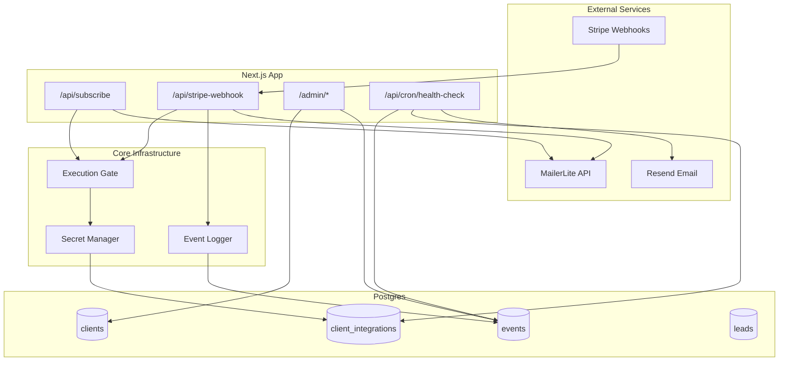

# Architecture

How the RevOps MVP system works under the hood.

---

## System Overview



---

## Database Schema

### Tables

**`clients`** - Your paying clients
- `id` (uuid, primary key)
- `name` (text) - Display name
- `slug` (text, unique) - Used in `?source=` routing
- `status` (ACTIVE | PAUSED) - Controls execution gating
- `timezone` (text, optional)
- `created_at` (timestamp)

**`client_integrations`** - Per-client encrypted secrets
- `id` (uuid, primary key)
- `client_id` (foreign key)
- `integration` (MAILERLITE | STRIPE | CALENDLY | MANYCHAT)
- `encrypted_secret` (text) - AES-256-GCM encrypted
- `meta` (jsonb) - Non-sensitive config (group IDs, product maps)
- `health_status` (GREEN | YELLOW | RED)
- `last_seen_at` (timestamp) - Last successful API call
- `created_at` (timestamp)
- Unique constraint: `(client_id, integration)`

**`leads`** - Ops state tracking (NOT a CRM)
- `id` (uuid, primary key)
- `client_id` (foreign key)
- `email` (text)
- `source` (text) - e.g., "landing", "ig_dm"
- `stage` (CAPTURED | BOOKED | PAID | DEAD)
- `error_state` (text, nullable)
- `created_at` (timestamp)
- `last_event_at` (timestamp) - For stuck lead detection

**`events`** - Append-only event ledger
- `id` (uuid, primary key)
- `client_id` (foreign key)
- `lead_id` (foreign key, nullable)
- `system` (BACKEND | MAILERLITE | STRIPE | CALENDLY | MANYCHAT | CRON)
- `event_type` (text) - e.g., "email_captured", "mailerlite_subscribe_success"
- `success` (boolean)
- `error_message` (text, nullable)
- `created_at` (timestamp)
- Indexes: `(client_id, created_at)`, `(success, created_at)`

**`admins`** - Single admin account
- `id` (uuid, primary key)
- `password_hash` (text) - Argon2id hash
- `created_at` (timestamp)

**`admin_sessions`** - Admin login sessions
- `id` (uuid, primary key) - Session ID stored in cookie
- `admin_id` (foreign key)
- `expires_at` (timestamp)
- `created_at` (timestamp)

---

## Core Components

### 1. Secret Management (`app/_lib/crypto.ts`)

**Encryption:**
- Algorithm: AES-256-GCM
- IV: 12 bytes random per encryption
- Master key: 32 bytes hex-encoded in `SRB_ENCRYPTION_KEY`
- Format: `base64(IV + ciphertext + auth_tag)`

**Security model:**
- Secrets encrypted at rest in Postgres
- Decrypted in memory at runtime only
- Never logged, never shown after initial paste
- Master key lives in env var only

### 2. Event Logging (`app/_lib/event-logger.ts`)

**What gets logged:**
- ✅ State transitions: `email_captured`, `mailerlite_subscribe_success`
- ✅ Integration outcomes: `stripe_payment_succeeded`, `mailerlite_subscribe_failed`
- ✅ Execution blocks: `execution_blocked`, `client_paused`
- ✅ Health changes: `health_status_changed`

**What does NOT get logged:**
- ❌ HTTP request/response details
- ❌ Full payloads
- ❌ Intermediate API attempts
- ❌ Debug-level information

**Why:** The events table is your primary debugging surface. Keep it signal, not noise.

### 3. Execution Gating (`app/_lib/client-gate.ts`)

**Flow:**
1. Request arrives with `?source=clientslug`
2. Look up client by slug
3. Check `client.status === 'ACTIVE'`
4. If PAUSED: emit `execution_blocked` event, return error
5. If ACTIVE: proceed with automation

**Use case:** Instant non-payment handling. Click "Pause" in admin UI → all webhooks/forms blocked.

### 4. Integration Manager (`app/_lib/integrations.ts`)

**Functions:**
- `getClientSecret(clientId, integration)` - Fetch + decrypt secret
- `getClientIntegration(clientId, integration)` - Get secret + meta
- `touchIntegration(clientId, integration)` - Update `last_seen_at` and set health to GREEN
- `markIntegrationUnhealthy(clientId, integration, status)` - Set YELLOW or RED

**Meta examples:**

MailerLite:
```json
{
  "groupIds": {
    "lead": "123456",
    "customer": "789012",
    "customer_premium": "345678"
  }
}
```

Stripe:
```json
{
  "apiKey": "sk_live_xxx",
  "productMap": {
    "price_abc": "premium_offer"
  }
}
```

---

## API Routes

### Public Routes (Used by Clients)

**`POST /api/subscribe?source={slug}`**
- Email capture from landing pages
- Flow:
  1. Look up client by slug
  2. Check if active (execution gate)
  3. Get MailerLite integration config
  4. Create/update lead record
  5. Emit `email_captured` event
  6. Call MailerLite API to add subscriber
  7. Emit `mailerlite_subscribe_success/failed` event
  8. Touch integration (update `last_seen_at`)

**`POST /api/stripe-webhook?source={slug}`**
- Payment webhooks from Stripe
- Flow:
  1. Look up client by slug
  2. Check if active (execution gate)
  3. Get Stripe integration (webhook secret)
  4. Verify signature
  5. Touch Stripe integration
  6. If event = `checkout.session.completed`:
     - Extract customer email
     - Create/update lead, set stage to PAID
     - Emit `stripe_payment_succeeded` event
     - Get MailerLite integration
     - Add customer to MailerLite group
     - Emit `mailerlite_subscribe_success/failed` event
     - Touch MailerLite integration

### Admin Routes (Internal Only)

**`POST /api/admin/login`**
- Verify password against Argon2 hash
- Create session in `admin_sessions`
- Set httpOnly cookie with session ID

**`POST /api/admin/logout`**
- Delete session from `admin_sessions`
- Clear cookie

**`GET /api/admin/clients`**
- List all clients with health indicators
- Client health = worst health among all integrations

**`GET /api/admin/clients/[id]`**
- Client details
- Last 50 events
- Per-integration health
- Stuck leads (captured >24h ago, no progress)

**`PATCH /api/admin/clients/[id]`**
- Actions: `pause`, `unpause`
- Emits `client_paused/unpaused` event

**`POST /api/admin/integrations`**
- Add new integration for a client
- Encrypts secret before storing
- Emits `integration_added` event

### Cron Route

**`GET /api/cron/health-check`**
- **Authentication:** Hard-fails without `Authorization: Bearer {CRON_SECRET}`
- Runs every 15 minutes via Vercel cron (see `vercel.json`)
- Checks:
  1. **Silence**: Any integration with no events in 4+ hours
  2. **Consecutive failures**: 3+ failed events in a row for an integration
  3. **Stuck leads**: Leads in CAPTURED stage with no activity in 24h
- Actions:
  - Updates `health_status` on integrations
  - Emits `health_status_changed` events
  - Sends alert email via Resend if issues found

---

## Authentication & Sessions

**Admin Auth:**
- Password-only (no username)
- Argon2id hashing with:
  - Memory cost: 64MB
  - Time cost: 3 iterations
  - Parallelism: 4 threads
- Sessions stored in Postgres
- Session cookie: httpOnly, secure (prod), sameSite strict
- Session duration: 14 days
- No OAuth, no multi-user

**Why this model:** Single internal admin. Minimal attack surface. Easy revocation.

---

## Security Considerations

**Secrets:**
- Master encryption key is single point of failure
- Back it up securely
- No key rotation support yet (planned post-MVP)

**Admin access:**
- Single password
- No 2FA (yet)
- No audit log of admin actions (yet)
- Consider IP allowlisting in production

**Client isolation:**
- Clients identified by `slug` in URL
- No cross-client access possible (enforced by DB queries)
- Secrets never exposed in API responses

**Cron protection:**
- `CRON_SECRET` in Authorization header
- Hard-fails without it (no soft warnings)
- Vercel cron jobs auto-authenticate

---

## Performance & Scaling

**Current bottlenecks:**
- Event table will grow unbounded
  - Solution: Periodic cleanup (see OPERATIONS.md)
- No connection pooling
  - Solution: Vercel uses serverless - connections managed per function invocation
- No caching
  - Solution: Acceptable for MVP scale (< 10 clients)

**When to optimize:**
- Event queries slow (>1s): Add more indexes, implement pagination
- Health checks timing out: Move to background job queue
- Database connection limits: Add PgBouncer

**Don't optimize until you have 10+ active clients.**

---

## Event Logging Discipline

Events are the primary debugging surface. Keep them clean:

**DO log:**
- State transitions
- Integration successes/failures
- Execution blocks
- Health status changes

**DO NOT log:**
- Every HTTP request
- Full payloads
- Retry attempts
- Debug information

**Event naming convention:**
- System prefix: `mailerlite_`, `stripe_`, `execution_`, `health_`
- Action: `subscribe`, `payment`, `blocked`, `status_changed`
- Outcome: `_success`, `_failed`

Examples:
- ✅ `mailerlite_subscribe_success`
- ✅ `stripe_payment_failed`
- ✅ `execution_blocked`
- ❌ `http_request_received`
- ❌ `processing_started`

