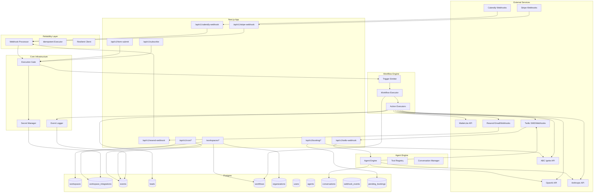

# Architecture

How the RevLine platform works under the hood.

---

## System Overview



> **Note:** The Workflow Engine is the central automation layer. All triggers (webhooks, email captures, form submissions) emit events that the engine matches against configured workflows. See [Workflow Engine Documentation](./WORKFLOW-ENGINE.md) for details.

---

## Database Schema

### Tables

**`organizations`** — Multi-tenant organization grouping
- `id` (uuid, primary key)
- `name` (text) — Display name
- `slug` (text, unique) — Organization identifier
- `created_at` (timestamp)

**`organization_members`** — User-organization access with permissions
- `id` (uuid, primary key)
- `organization_id` (foreign key → organizations)
- `user_id` (foreign key → users)
- `is_owner` (boolean)
- `permissions` (jsonb) — OrgPermissions type
- `created_at` (timestamp)
- Unique constraint: `(organization_id, user_id)`

**`organization_templates`** — Org-scoped form/booking templates
- `id` (uuid, primary key)
- `organization_id` (foreign key → organizations)
- `type` (text) — 'booking', 'signup', etc.
- `name` (text)
- `schema` (jsonb) — Field definitions
- `default_copy` (jsonb)
- `default_branding` (jsonb, nullable)
- `enabled` (boolean)
- `created_at`, `updated_at` (timestamps)
- Unique constraint: `(organization_id, type)`

**`workspaces`** — Your paying clients' workspaces
- `id` (uuid, primary key)
- `organization_id` (foreign key → organizations, nullable)
- `name` (text) — Display name
- `slug` (text, unique) — Used in `?source=` routing
- `status` (ACTIVE | PAUSED) — Controls execution gating
- `timezone` (text) — IANA timezone for health checks
- `created_by_id` (text, nullable)
- `custom_domain` (text, unique, nullable) — e.g., "book.clientgym.com"
- `domain_verify_token`, `domain_verified`, `domain_verified_at` — Domain verification
- `lead_stages` (jsonb) — Custom pipeline stages array `[{ key, label, color }]`
- `lead_property_schema` (jsonb, nullable) — Custom lead property definitions
- `created_at` (timestamp)

**`workspace_members`** — User-workspace access with roles
- `id` (uuid, primary key)
- `user_id` (foreign key → users)
- `workspace_id` (foreign key → workspaces)
- `role` (OWNER | ADMIN | MEMBER | VIEWER)
- `created_at` (timestamp)
- Unique constraint: `(user_id, workspace_id)`

**`workspace_assignments`** — Optional granular workspace access control
- `id` (uuid, primary key)
- `user_id` (foreign key → users)
- `workspace_id` (foreign key → workspaces)
- `created_at` (timestamp)
- Unique constraint: `(user_id, workspace_id)`

**`workspace_integrations`** — Per-workspace encrypted secrets and config
- `id` (uuid, primary key)
- `workspace_id` (foreign key → workspaces)
- `integration` (enum: MAILERLITE | STRIPE | CALENDLY | MANYCHAT | ABC_IGNITE | REVLINE | RESEND | TWILIO | ANTHROPIC | OPENAI)
- `secrets` (jsonb) — Array of `{ id, name, encryptedValue, keyVersion }`
- `meta` (jsonb, nullable) — Non-sensitive config (group IDs, product maps, templates, etc.)
- `health_status` (GREEN | YELLOW | RED)
- `last_seen_at` (timestamp, nullable)
- `created_at` (timestamp)
- Unique constraint: `(workspace_id, integration)`

**`leads`** — Ops state tracking (NOT a CRM)
- `id` (uuid, primary key)
- `workspace_id` (foreign key → workspaces)
- `email` (text)
- `source` (text, nullable) — e.g., "landing", "ig_dm"
- `stage` (text, default "CAPTURED") — Dynamic per-workspace stages
- `error_state` (text, nullable)
- `properties` (jsonb, nullable) — Custom lead properties validated against workspace schema
- `created_at` (timestamp)
- `last_event_at` (timestamp)
- Unique constraint: `(workspace_id, email)`

**`events`** — Append-only event ledger
- `id` (uuid, primary key)
- `workspace_id` (foreign key → workspaces)
- `lead_id` (foreign key → leads, nullable)
- `system` (enum: BACKEND | MAILERLITE | STRIPE | CALENDLY | MANYCHAT | ABC_IGNITE | RESEND | TWILIO | OPENAI | ANTHROPIC | AGENT | CRON | WORKFLOW)
- `event_type` (text) — e.g., "email_captured", "mailerlite_subscribe_success"
- `success` (boolean)
- `error_message` (text, nullable)
- `created_at` (timestamp)
- Indexes: `(workspace_id, created_at)`, `(success, created_at)`

**`users`** — Platform user accounts
- `id` (uuid, primary key)
- `email` (text, unique) — Login identity
- `name` (text, nullable)
- `password_hash` (text) — Argon2id hash
- `totp_secret` (text, nullable) — Encrypted TOTP secret for 2FA
- `totp_key_version` (int) — Key version used to encrypt TOTP
- `totp_enabled` (boolean)
- `recovery_codes` (jsonb, nullable) — Array of `{ hash, used }` recovery codes
- `created_at` (timestamp)

**`sessions`** — User login sessions
- `id` (uuid, primary key) — Session ID stored in cookie
- `user_id` (foreign key → users)
- `expires_at` (timestamp)
- `created_at` (timestamp)

**`workflows`** — Configurable automation workflows
- `id` (uuid, primary key)
- `workspace_id` (foreign key → workspaces)
- `name` (text)
- `description` (text, nullable)
- `enabled` (boolean)
- `trigger_adapter` (text) — e.g., "calendly", "stripe", "resend", "agent"
- `trigger_operation` (text) — e.g., "booking_created", "email_bounced"
- `trigger_filter` (jsonb, nullable)
- `actions` (jsonb) — Array of action definitions
- `created_at`, `updated_at` (timestamps)
- Indexes: `(workspace_id, enabled)`, `(workspace_id, trigger_adapter, trigger_operation)`

**`workflow_executions`** — Execution history and audit trail
- `id` (uuid, primary key)
- `workflow_id` (foreign key → workflows)
- `workspace_id` (foreign key → workspaces)
- `correlation_id` (uuid, nullable) — Links to webhook_events for tracing
- `trigger_adapter` (text)
- `trigger_operation` (text)
- `trigger_payload` (jsonb)
- `status` (RUNNING | COMPLETED | FAILED)
- `action_results` (jsonb, nullable)
- `error` (text, nullable)
- `retry_count` (int) — How many times retried
- `last_retry_at` (timestamp, nullable)
- `retry_requested_by` (text, nullable) — User ID for audit
- `started_at`, `completed_at` (timestamps)
- Indexes: `(workspace_id, started_at)`, `(workflow_id, started_at)`, `(status)`, `(correlation_id)`

**`webhook_events`** — Raw webhook deduplication and payload storage
- `id` (uuid, primary key)
- `workspace_id` (foreign key → workspaces)
- `correlation_id` (uuid) — Shared with workflow_executions
- `provider` (text) — 'stripe', 'calendly', 'revline'
- `provider_event_id` (text) — External dedup key
- `raw_body` (text) — Exact bytes for signature verification
- `raw_headers` (jsonb, nullable)
- `parsed_payload` (jsonb, nullable)
- `status` (PENDING | PROCESSING | PROCESSED | FAILED)
- `error` (text, nullable)
- `received_at`, `processing_started_at`, `processed_at` (timestamps)
- Unique constraint: `(workspace_id, provider, provider_event_id)`

**`idempotency_keys`** — Action deduplication
- `id` (uuid, primary key)
- `workspace_id` (foreign key → workspaces)
- `key` (text) — Hash of (action + params)
- `status` (PENDING | COMPLETED | FAILED)
- `result` (jsonb, nullable)
- `error` (text, nullable)
- `created_at`, `completed_at`, `expires_at` (timestamps)
- Unique constraint: `(workspace_id, key)`

**`pending_bookings`** — Magic link booking flow
- `id` (uuid, primary key)
- `workspace_id` (foreign key → workspaces)
- `provider` (text) — 'abc_ignite', 'calendly', etc.
- `customer_id`, `customer_email`, `customer_name` — Generic customer info
- `staff_id`, `staff_name` — Staff/trainer info
- `service_id`, `service_name` — Event type/service info
- `scheduled_at` (timestamp)
- `provider_data` (jsonb, nullable) — Provider-specific context
- `provider_payload` (jsonb, nullable) — Exact API payload to send on confirm
- `token_hash` (text, unique) — SHA-256 hash of magic link token
- `status` (PENDING | CONFIRMED | EXPIRED | FAILED)
- `expires_at`, `confirmed_at` (timestamps)
- `external_id` (text, nullable) — Provider's booking ID after confirm
- `failure_reason` (text, nullable)

**`agents`** — AI agent definitions
- `id` (uuid, primary key)
- `workspace_id` (foreign key → workspaces)
- `name`, `description` — Display
- `channel_type`, `channel_integration`, `channel_address` — SMS/channel config
- `ai_integration` (text) — "OPENAI" or "ANTHROPIC"
- `system_prompt`, `initial_message` — Prompt config
- `model_override`, `temperature_override`, `max_tokens_override` — AI tuning
- Guardrails: `max_messages_per_conversation`, `max_tokens_per_conversation`, `conversation_timeout_minutes`, `response_delay_seconds`, `auto_resume_minutes`, `rate_limit_per_hour`
- `fallback_message`, `escalation_pattern`, `faq_overrides` — Safety config
- `allowed_events` (jsonb) — Event types the bot can emit
- `enabled_tools` (jsonb) — Tool names from tool registry
- `active` (boolean)

**`conversations`** — Agent conversation sessions
- `id` (uuid, primary key)
- `workspace_id`, `agent_id`, `lead_id` (foreign keys)
- `channel` (text) — "SMS"
- `contact_address`, `channel_address` — Phone numbers
- `status` (ACTIVE | PAUSED | COMPLETED | ESCALATED | TIMED_OUT)
- `message_count`, `total_tokens` — Usage tracking
- `metadata` (jsonb) — Detected intents, goal progress
- `is_test` (boolean)
- `paused_at`, `paused_by` — Human takeover
- `started_at`, `last_message_at`, `ended_at` (timestamps)

**`conversation_messages`** — Individual messages in conversations
- `id` (uuid, primary key)
- `conversation_id` (foreign key)
- `role` (USER | ASSISTANT | SYSTEM)
- `content` (text)
- `prompt_tokens`, `completion_tokens` — Token tracking
- `turn_log` (jsonb) — Tool calls, reasoning
- `created_at` (timestamp)

**`opt_out_records`** — SMS opt-out compliance
- `id` (uuid, primary key)
- `workspace_id` (foreign key → workspaces)
- `contact_address` (text) — Phone number
- `reason` (text) — "STOP", "UNSUBSCRIBE", etc.
- `source` (text) — "agent", "manual", "twilio_webhook"
- `agent_id`, `conversation_id` (nullable)
- Unique constraint: `(workspace_id, contact_address)`

---

## Core Components

### 1. Secret Management (`app/_lib/crypto.ts`)

**What we store per WorkspaceIntegration:**
- `secrets` (jsonb): Array of `{ id, name, encryptedValue, keyVersion }` — supports multiple named secrets per integration
- `meta` (jsonb): Non-sensitive config only (group IDs, product maps, templates). All sensitive data in `secrets`.

**Encryption model:**
- Algorithm: AES-256-GCM (256-bit key)
- IV: 12 bytes random per encryption
- Auth tag: 16 bytes (128 bits) appended for integrity
- Format: `encryptedValue = base64(IV || ciphertext || auth_tag)`

**Keyring:**
```typescript
const KEYRING: Map<number, Buffer> = new Map([
  [0, parseHexKey(process.env.SRB_ENCRYPTION_KEY!, "SRB_ENCRYPTION_KEY")],        // Legacy
  [1, parseHexKey(process.env.REVLINE_ENCRYPTION_KEY_V1!, "REVLINE_ENCRYPTION_KEY_V1")], // Current
]);
const CURRENT_KEY_VERSION = 1;
```

**Encrypt flow:**
1. Always uses `CURRENT_KEY_VERSION` and corresponding key
2. Returns `{ encryptedSecret, keyVersion }`
3. Both values stored in the secrets JSON array

**Decrypt flow:**
1. Read `keyVersion` from the individual secret entry
2. Look up `KEYRING.get(keyVersion)`
3. If version not found: hard failure with clear error
4. Decrypt using that key

**Where secrets are used:**
- Decrypted only at point-of-use inside backend adapters
- Never sent to frontend, never logged, never in API responses
- Not shown in UI (except confirmation that secret exists)

**Key rotation plan (built-in):**
1. Generate new key: `openssl rand -hex 32`
2. Add to env: `REVLINE_ENCRYPTION_KEY_V2=<new key>`
3. Update code: add to KEYRING, set `CURRENT_KEY_VERSION = 2`
4. Deploy: new secrets use V2, old secrets still decrypt via V1
5. Migration: background job re-encrypts V1 → V2
6. Cleanup: remove V1 from keyring and env after migration complete

### 2. Event Logging (`app/_lib/event-logger.ts`)

**What gets logged:**
- State transitions: `email_captured`, `lead_stage_changed`
- Integration outcomes: `stripe_payment_succeeded`, `mailerlite_subscribe_failed`
- Execution blocks: `execution_blocked`, `client_paused`
- Health changes: `health_status_changed`
- Agent events: `conversation_started`, `escalation_requested`
- Workflow events: execution results, trigger matches

**What does NOT get logged:**
- HTTP request/response details
- Full payloads
- Intermediate API attempts
- Debug-level information

**Why:** The events table is your primary debugging surface. Keep it signal, not noise.

### 3. Execution Gating (`app/_lib/client-gate.ts`)

**Flow:**
1. Request arrives with `?source=workspaceslug`
2. Look up workspace by slug
3. Check `workspace.status === 'ACTIVE'`
4. If PAUSED: emit `execution_blocked` event, return error
5. If ACTIVE: proceed with automation

**Use case:** Instant non-payment handling. Click "Pause" in dashboard → all webhooks/forms blocked.

### 4. Workflow Engine (`app/_lib/workflow/`)

The workflow engine is the central automation layer that connects triggers to actions.

**Key Components:**

| File | Purpose |
|------|---------|
| `types.ts` | TypeScript interfaces for workflows, contexts, results |
| `registry.ts` | Adapter definitions (triggers & actions) — 11 adapters |
| `engine.ts` | Core execution logic |
| `validation.ts` | Workflow configuration validation |
| `integration-config.ts` | Integration requirement checking |
| `executors/` | Action executor implementations (9 executors) |

**How it works:**

1. **Trigger Emission:** Webhook handlers call `emitTrigger()` with event data
2. **Workflow Matching:** Engine finds all enabled workflows for this trigger
3. **Filter Evaluation:** Optional filter conditions checked against payload
4. **Action Execution:** Actions run sequentially; stops on first error
5. **Result Recording:** Execution logged to `workflow_executions` table with correlation ID

**Available Adapters:**

| Adapter | Triggers | Actions |
|---------|----------|---------|
| `calendly` | booking_created, booking_canceled | — |
| `stripe` | payment_succeeded, subscription_created, subscription_canceled | — |
| `mailerlite` | — | add_to_group, remove_from_group, add_tag |
| `revline` | (dynamic per-workspace form triggers) | create_lead, update_lead_properties, update_lead_stage, emit_event |
| `manychat` | dm_received | trigger_flow, add_tag |
| `abc_ignite` | new_member | lookup_member, check_availability, enroll_member, unenroll_member, add_to_waitlist, remove_from_waitlist |
| `resend` | email_bounced, email_complained, email_failed, email_delivery_delayed | send_email |
| `twilio` | sms_received | send_sms |
| `openai` | — | generate_text |
| `anthropic` | — | generate_text |
| `agent` | conversation_started, escalation_requested, conversation_completed, contact_opted_out, bot_event | route_to_agent |

**For full details:** See [Workflow Engine Documentation](./WORKFLOW-ENGINE.md)

### 5. Integration Manager (`app/_lib/integrations-core.ts`, `app/_lib/integrations/`)

Adapters live in `app/_lib/integrations/` with a consistent pattern:

| File | Purpose |
|------|---------|
| `base.ts` | Abstract base class for all adapters |
| `mailerlite.adapter.ts` | MailerLite email list management |
| `stripe.adapter.ts` | Stripe payment processing |
| `abc-ignite.adapter.ts` | ABC Ignite gym member management |
| `revline.adapter.ts` | Internal lead/event operations |
| `resend.adapter.ts` | Transactional email |
| `twilio.adapter.ts` | SMS messaging |
| `openai.adapter.ts` | OpenAI text generation |
| `anthropic.adapter.ts` | Anthropic Claude text generation |
| `config.ts` | Integration UI metadata |
| `index.ts` | Exports |

**Core functions (integrations-core.ts):**
- `getWorkspaceSecret(workspaceId, integration)` — Fetch + decrypt primary secret from the secrets array
- `getWorkspaceIntegration(workspaceId, integration)` — Get secret + meta
- `touchIntegration(workspaceId, integration)` — Update `last_seen_at` and set health to GREEN
- `markIntegrationUnhealthy(workspaceId, integration, status)` — Set YELLOW or RED

### 6. Agent Engine (`app/_lib/agent/`)

AI-powered conversational agents for SMS (and future channels).

| File | Purpose |
|------|---------|
| `engine.ts` | Core agent processing loop |
| `adapter-registry.ts` | AI provider adapters (OpenAI, Anthropic) |
| `tool-registry.ts` | Available tools agents can invoke |
| `escalation.ts` | Escalation pattern detection |
| `pricing.ts` | Token cost calculation |
| `file-extract.ts` | Document parsing for agent context |
| `schemas.ts` | Zod schemas for agent config |
| `types.ts` | TypeScript interfaces |

**Flow:** Inbound SMS → Twilio webhook → find/create conversation → load agent config → generate AI response → send reply via Twilio

### 7. Booking System (`app/_lib/booking/`)

Provider-agnostic booking with magic link confirmation.

| File | Purpose |
|------|---------|
| `index.ts` | Main booking flow orchestration |
| `get-provider.ts` | Provider resolution (ABC Ignite, etc.) |
| `magic-link.ts` | Token generation, hashing, confirmation |
| `types.ts` | Booking type definitions |

**Flow:** Client requests booking → pending_booking created → magic link emailed → client clicks link → booking confirmed with provider API

### 8. Reliability Infrastructure (`app/_lib/reliability/`)

| File | Purpose |
|------|---------|
| `webhook-processor.ts` | Deduplicates webhook events, stores raw payloads |
| `idempotent-executor.ts` | Prevents duplicate action execution |
| `resilient-client.ts` | HTTP client with timeout/retry |
| `types.ts` | Reliability type definitions |

---

## API Routes

### Public Routes

**`POST /api/v1/subscribe?source={slug}`** — Email capture from landing pages
**`POST /api/v1/form-submit`** — Generic form submission endpoint
**`GET /api/v1/check-form-id`** — Validate a form ID exists
**`GET /api/v1/health`** — Application health check

### Webhook Routes

**`POST /api/v1/stripe-webhook`** — Stripe payment webhooks
**`POST /api/v1/calendly-webhook`** — Calendly booking webhooks
**`POST /api/v1/resend-webhook`** — Resend email event webhooks (bounces, complaints, failures)
**`POST /api/v1/twilio-webhook`** — Twilio inbound SMS webhooks

### Auth Routes

**`POST /api/v1/auth/login`** — Email + password login
**`POST /api/v1/auth/logout`** — Destroy session
**`POST /api/v1/auth/setup`** — Initial account setup
**`POST /api/v1/auth/login/verify-2fa`** — TOTP verification during login

### 2FA Routes

**`POST /api/v1/auth/2fa/setup`** — Generate TOTP secret for 2FA setup
**`POST /api/v1/auth/2fa/verify`** — Verify TOTP code and enable 2FA
**`POST /api/v1/auth/2fa/disable`** — Disable 2FA
**`GET /api/v1/auth/2fa/status`** — Check 2FA enabled status
**`POST /api/v1/auth/2fa/regenerate`** — Regenerate recovery codes

### Organization Routes

**`GET/POST /api/v1/organizations`** — List/create organizations
**`GET/PATCH/DELETE /api/v1/organizations/[id]`** — Organization CRUD
**`GET/POST /api/v1/organizations/[id]/members`** — Org member management
**`GET/POST /api/v1/organizations/[id]/templates`** — Org template management

### Workspace Routes

**`GET/POST /api/v1/workspaces`** — List/create workspaces
**`GET/PATCH/DELETE /api/v1/workspaces/[id]`** — Workspace CRUD
**`GET /api/v1/workspaces/[id]/events`** — Workspace event history
**`GET /api/v1/workspaces/[id]/health-check`** — Run health check
**`GET /api/v1/workspaces/[id]/mailerlite-insights`** — MailerLite stats
**`GET /api/v1/workspaces/[id]/summary`** — Workspace summary/stats
**`GET/POST /api/v1/workspaces/[id]/agents`** — Agent management
**`GET/POST /api/v1/workspaces/[id]/domain`** — Custom domain management
**`GET /api/v1/workspaces/[id]/opt-outs`** — SMS opt-out records
**`GET /api/v1/workspaces/[id]/dependency-graph`** — Integration dependency visualization
**`GET /api/v1/workspaces/[id]/property-sources`** — Lead property source tracking
**`GET /api/v1/workspaces/[id]/property-coverage`** — Lead property fill rates
**`GET /api/v1/workspaces/[id]/property-compatibility`** — Property schema compatibility
**`POST /api/v1/workspaces/[id]/test-integration`** — Test integration connectivity
**`POST /api/v1/workspaces/[id]/test-action`** — Test a workflow action
**`POST /api/v1/workspaces/[id]/test-action-direct`** — Test action without workflow
**`POST /api/v1/workspaces/[id]/test-scenario`** — Test a workflow scenario
**`POST /api/v1/workspaces/[id]/test-alert`** — Test alert notifications
**`POST /api/v1/workspaces/[id]/test-pushover`** — Test Pushover notification

### Integration Routes

**`GET/POST /api/v1/integrations`** — List/add integrations
**`GET/PATCH/DELETE /api/v1/integrations/[id]`** — Integration CRUD
**`GET/POST /api/v1/integrations/[id]/secrets`** — Manage integration secrets
**`GET /api/v1/integrations/[id]/meta`** — Get integration metadata
**`POST /api/v1/integrations/[id]/sync-employees`** — Sync ABC Ignite employees
**`POST /api/v1/integrations/[id]/sync-event-types`** — Sync ABC Ignite event types
**`GET /api/v1/integrations/[id]/openai-models`** — List OpenAI models
**`GET /api/v1/integrations/[id]/anthropic-models`** — List Anthropic models
**`GET /api/v1/integrations/[id]/resend-templates`** — List Resend templates

### Workflow Routes

**`GET/POST /api/v1/workflows`** — List/create workflows
**`GET/PATCH/DELETE /api/v1/workflows/[id]`** — Workflow CRUD
**`PATCH /api/v1/workflows/[id]/toggle`** — Enable/disable workflow
**`GET /api/v1/workflows/[id]/executions`** — Execution history
**`POST /api/v1/executions/[execId]/retry`** — Retry a failed execution
**`GET /api/v1/workflow-registry`** — Available adapters/triggers/actions

### Booking Routes

**`POST /api/v1/booking/request`** — Request a new booking (creates pending booking + magic link)
**`POST /api/v1/booking/create`** — Create booking directly
**`GET /api/v1/booking/confirm/[token]`** — Confirm via magic link
**`POST /api/v1/booking/lookup`** — Look up member by barcode/email
**`GET /api/v1/booking/eligibility`** — Check member eligibility
**`GET /api/v1/booking/availability`** — Check staff availability
**`GET /api/v1/booking/employees`** — List available staff/trainers

### Form Routes

**`GET /api/v1/forms`** — List available forms
**`POST /api/v1/form-submit`** — Submit a form
**`GET /api/v1/check-form-id`** — Validate form ID

### Cron Routes

**`GET /api/v1/cron/health-check`** — Integration health monitoring (every 15min)
**`GET /api/v1/cron/data-cleanup`** — Expired data cleanup
**`GET /api/v1/cron/abc-member-sync`** — Sync new members from ABC Ignite

All cron routes require `Authorization: Bearer {CRON_SECRET}`.

---

## Authentication & Sessions

### Authentication Model

Multi-user authentication with email + password and optional 2FA.

**How it works:**
1. User submits email + password to `/api/v1/auth/login`
2. User looked up by email, password verified against Argon2id hash
3. If 2FA enabled: returns `requires2FA: true`, user must verify TOTP
4. On success: session created in `sessions` table
5. Session ID stored in httpOnly cookie
6. Subsequent requests include cookie automatically
7. Each protected route validates session before processing

**Session Validation:**
- Cookie name: `revline_session`
- Session looked up in database
- Expiration checked (14-day duration)
- Expired sessions deleted automatically
- Invalid/missing session returns 401 or redirects to login

**User Auth:**
- Email + password (multi-user)
- Argon2id hashing with:
  - Memory cost: 64MB
  - Time cost: 3 iterations
  - Parallelism: 4 threads
- Sessions stored in Postgres
- Session cookie: httpOnly, secure (prod), sameSite strict
- Session duration: 14 days

### Access Control

- **Organizations:** Users belong to organizations with permissions (`is_owner`, `permissions` JSON)
- **Workspace Roles:** Users are assigned roles per workspace:
  - `OWNER` — Full control, can delete workspace
  - `ADMIN` — Manage integrations, workflows, view all data
  - `MEMBER` — View and edit most things, no secret management
  - `VIEWER` — Read-only access

### Two-Factor Authentication (2FA)

**TOTP-based 2FA** is fully implemented:

**Setup flow:**
1. User calls `/api/v1/auth/2fa/setup` to get TOTP secret
2. Secret displayed as QR code for authenticator app
3. User enters TOTP code to verify
4. 2FA enabled, recovery codes generated

**Login flow with 2FA:**
1. Password verified → returns `requires2FA: true`
2. User enters TOTP code
3. Code verified → session created

**Recovery:**
- 8 one-time recovery codes generated on setup
- Each code can only be used once
- Codes are hashed before storage

**TOTP Implementation:**
- Algorithm: SHA-1 (standard)
- Period: 30 seconds
- Digits: 6
- Secret encrypted with AES-256-GCM (same keyring as integration secrets)

---

## Security Considerations

### What This Protects

**DB or backup theft:**
- Attacker only gets encrypted secret blobs
- Without env key, secrets are not decryptable
- Key version tracking prevents confusion during rotation

**Read-only DB access (misconfigured dashboard, SQL injection):**
- Still only ciphertext visible
- Meta contains non-sensitive config only

**Log theft:**
- No secrets logged by design
- Event system logs outcomes, not payloads

### What This Does NOT Protect

**Full compromise of app env / container:**
- If attacker can read env vars, they can load the keyring and decrypt
- Mitigation: Railway secrets management, container isolation

**Arbitrary code execution in backend:**
- Attacker can call the same decrypt functions as your own code
- Mitigation: standard security hygiene (dependency audit, input validation)

This threat model is acceptable at startup stage. For higher security, consider AWS KMS or HashiCorp Vault.

### Key Management

**Environment variables required:**
```bash
# Legacy key (version 0) - keep until all secrets migrated
SRB_ENCRYPTION_KEY=<64 hex chars>

# Current key (version 1)
REVLINE_ENCRYPTION_KEY_V1=<64 hex chars>

# Future keys (add when rotating)
# REVLINE_ENCRYPTION_KEY_V2=<64 hex chars>
```

**Backup strategy:**
- Back up master encryption keys offline (encrypted USB, password manager)
- If keys are lost, all secrets are unrecoverable
- Railway stores backups, but encrypted secrets are useless without keys

**Client isolation:**
- Workspaces identified by `slug` in URL
- No cross-workspace access possible (enforced by DB queries + workspace membership)
- Secrets never exposed in API responses

**Cron protection:**
- `CRON_SECRET` in Authorization header
- Hard-fails without it (no soft warnings)
- External cron service must include Authorization header

---

## Performance & Scaling

**Current bottlenecks:**
- Event table will grow unbounded
  - Solution: `data-cleanup` cron job handles expired records
- No connection pooling
  - Solution: Railway uses container-based deployment — connections managed per instance
- No caching
  - Solution: Acceptable for current scale

**When to optimize:**
- Event queries slow (>1s): Add more indexes, implement pagination
- Health checks timing out: Move to background job queue
- Database connection limits: Add PgBouncer

---

## Event Logging Discipline

Events are the primary debugging surface. Keep them clean:

**DO log:**
- State transitions
- Integration successes/failures
- Execution blocks
- Health status changes
- Agent conversation events

**DO NOT log:**
- Every HTTP request
- Full payloads
- Retry attempts
- Debug information

**Event naming convention:**
- System prefix: `mailerlite_`, `stripe_`, `execution_`, `health_`, `agent_`
- Action: `subscribe`, `payment`, `blocked`, `status_changed`
- Outcome: `_success`, `_failed`

Examples:
- `mailerlite_subscribe_success`
- `stripe_payment_failed`
- `execution_blocked`
- `agent_conversation_started`

---

*Last updated: March 2026*
