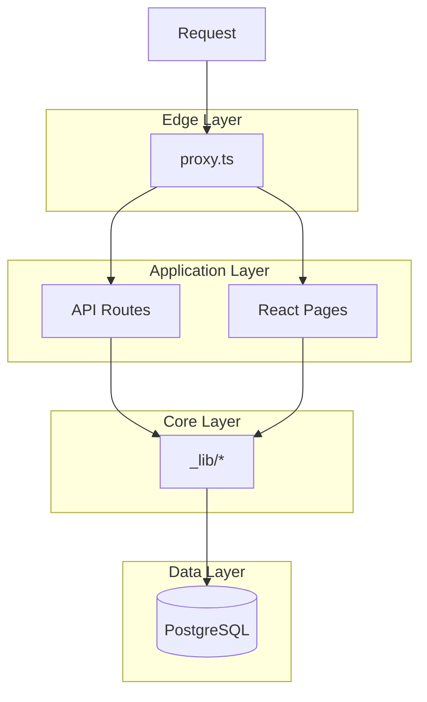
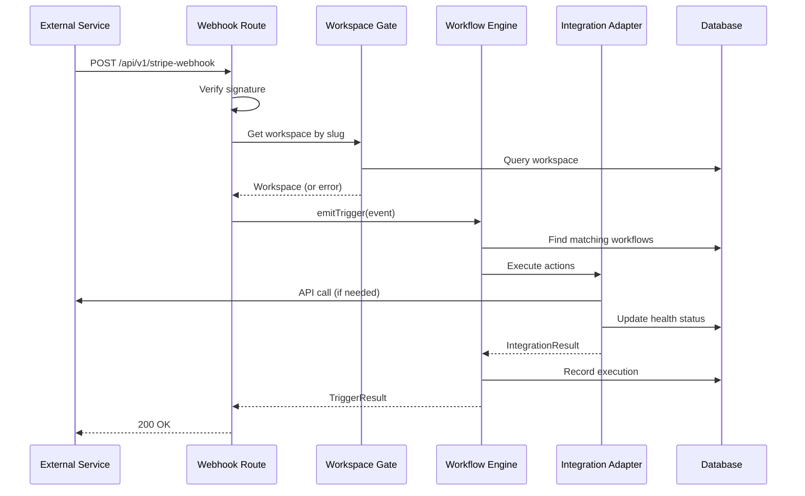
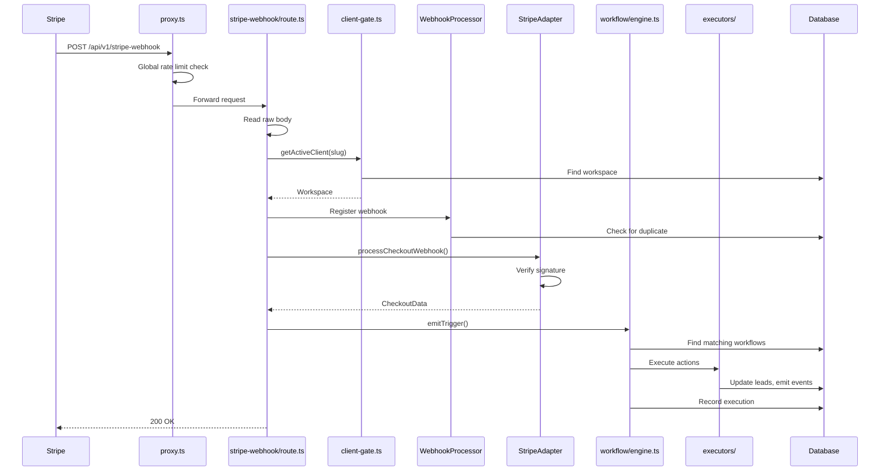
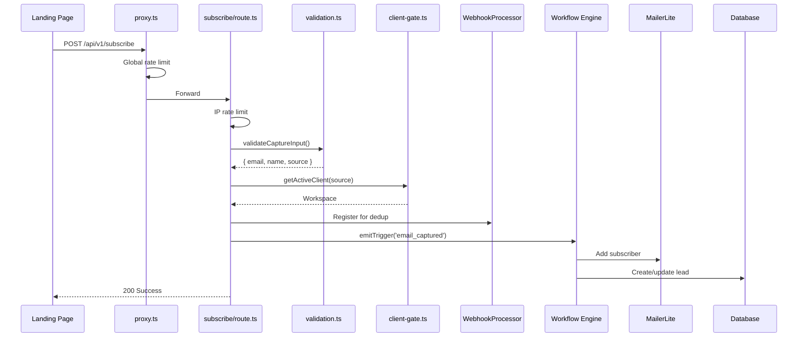
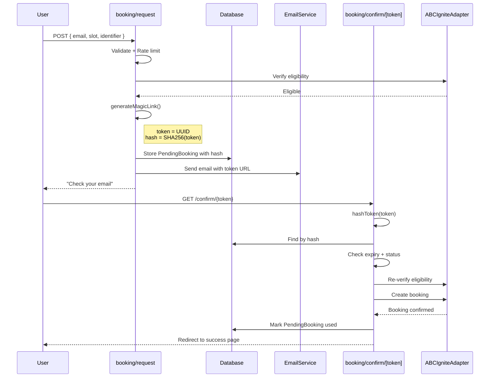
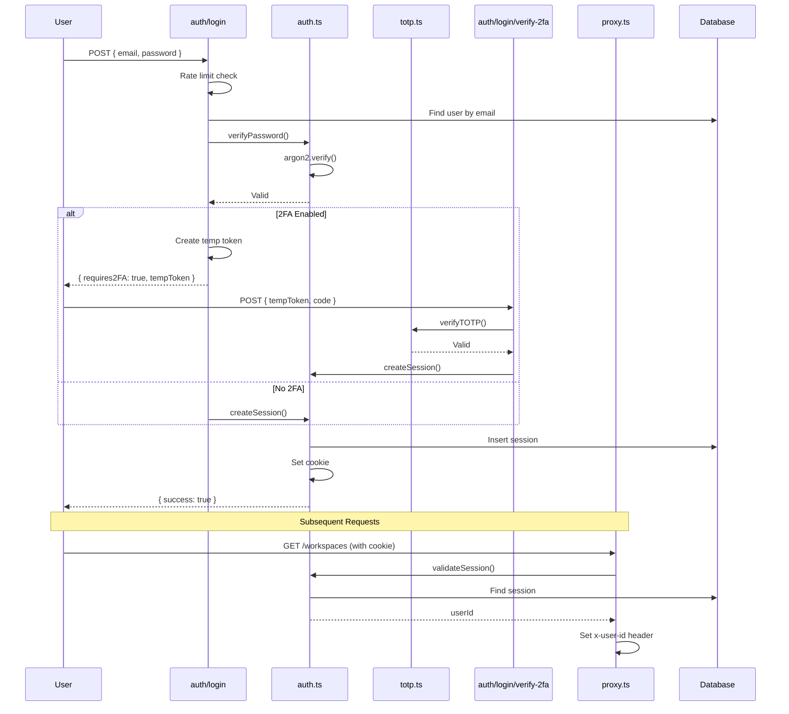
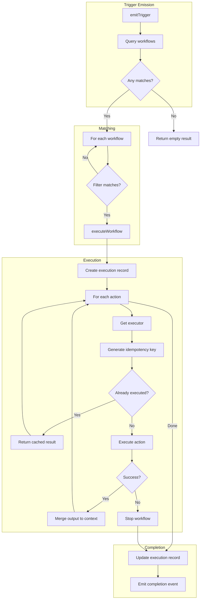
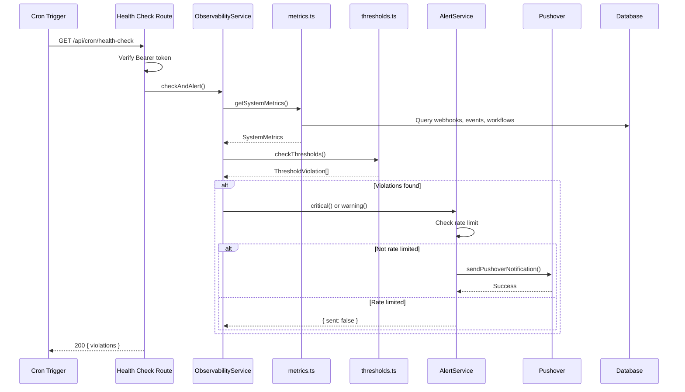

# RevLine Deep Dive Course

A comprehensive learning course for understanding the RevLine codebase. Follow the flow traces, pause at key mechanics, and connect patterns to system design concepts.

---

## Table of Contents

- [Part 1: Foundations](#part-1-foundations)
  - [1.1 System Architecture Overview](#11-system-architecture-overview)
  - [1.2 How We Integrate Software](#12-how-we-integrate-software)
  - [1.3 Security Model](#13-security-model)
- [Part 2: Flow Traces](#part-2-flow-traces)
  - [2.1 Webhook Flow (Stripe Payment)](#21-webhook-flow-stripe-payment)
  - [2.2 Public Form Flow (Email Capture)](#22-public-form-flow-email-capture)
  - [2.3 Magic Link Booking Flow](#23-magic-link-booking-flow)
  - [2.4 Admin Authentication Flow](#24-admin-authentication-flow)
  - [2.5 Workflow Engine Flow](#25-workflow-engine-flow)
  - [2.6 Health Check and Alerting Flow](#26-health-check-and-alerting-flow)
- [Part 3: Integration Deep Dives](#part-3-integration-deep-dives)
  - [3.1 The Base Adapter Pattern](#31-the-base-adapter-pattern)
  - [3.2 ABC Ignite Adapter](#32-abc-ignite-adapter)
  - [3.3 MailerLite Adapter](#33-mailerlite-adapter)
  - [3.4 Stripe Adapter](#34-stripe-adapter)
  - [3.5 Resend Adapter](#35-resend-adapter)
- [Part 4: Key Mechanics Reference](#part-4-key-mechanics-reference)
  - [4.1 Cryptography](#41-cryptography)
  - [4.2 Rate Limiting](#42-rate-limiting)
  - [4.3 Database Patterns](#43-database-patterns)
  - [4.4 HTTP Resilience](#44-http-resilience)

---

# Part 1: Foundations

These modules explain the system at a level where you could describe to a client how software integration works.

---

## 1.1 System Architecture Overview

### What RevLine Does

RevLine is a **multi-tenant integration platform**. It connects external services (Stripe, Calendly, ABC Ignite, MailerLite) to automate business workflows. Each workspace (tenant) has its own:

- Integrations with encrypted credentials
- Workflows that define automation rules
- Leads that track customer state
- Events that provide an audit trail

### The Three Layers



**Edge Layer (`proxy.ts`)**
- Runs before any route handler
- Global rate limiting (safety net)
- Session validation for protected routes
- Custom domain routing

**Application Layer (`app/api/`, `app/(dashboard)/`)**
- API route handlers receive validated requests
- React pages render the dashboard UI
- Thin layer - delegates to core

**Core Layer (`app/_lib/`)**
- All business logic lives here
- Integrations, workflows, auth, crypto
- Database operations
- Never imported by client components

### How Workspaces Isolate Data

Every database query is scoped by `workspaceId`:

```typescript
// Every query includes workspace scope
const lead = await prisma.lead.findFirst({
  where: {
    workspaceId,  // Always present
    email,
  },
});
```

This prevents cross-tenant data access at the query level. There's no way to accidentally fetch another workspace's data because the scope is required by the schema constraints.

### The Adapter Pattern in Plain English

Think of adapters as **translators**. Every external API speaks a different language:

- Stripe sends webhooks with signatures in one format
- Calendly uses a different signature format
- ABC Ignite uses API keys in headers
- MailerLite uses Bearer tokens

The adapter pattern gives us a **consistent interface** regardless of the external API:

```
Your Code → Adapter → External API
                ↓
         Normalized Result
```

Benefits:
- Swap providers without changing business logic
- Consistent error handling across all integrations
- Centralized health tracking
- Easier testing (mock the adapter, not HTTP)

---

## 1.2 How We Integrate Software

### The Problem: Every External API is Different

When you integrate with external services, you face:

1. **Different authentication**: API keys, OAuth, signatures
2. **Different data formats**: JSON structures vary wildly
3. **Different error handling**: Status codes mean different things
4. **Different rate limits**: Some are strict, some are generous
5. **Different reliability**: Some have great uptime, others don't

If you handle each integration directly in your routes, you end up with:
- Duplicated error handling
- Inconsistent logging
- No central place to track health
- Difficult to swap providers

### The Solution: Normalize Through Adapters

Every integration follows this pattern:

```
┌─────────────────────────────────────────────────────────────┐
│                     BaseIntegrationAdapter                   │
├─────────────────────────────────────────────────────────────┤
│  - workspaceId: string                                      │
│  - secrets: IntegrationSecret[]                             │
│  - meta: TMeta                                              │
├─────────────────────────────────────────────────────────────┤
│  # getSecret(name): string | null                           │
│  # touch(): Promise<void>           // Mark healthy         │
│  # markUnhealthy(): Promise<void>   // Mark failed          │
│  # success<T>(data): IntegrationResult<T>                   │
│  # error<T>(msg): IntegrationResult<T>                      │
└─────────────────────────────────────────────────────────────┘
                              △
                              │ extends
        ┌─────────────────────┼─────────────────────┐
        │                     │                     │
┌───────┴───────┐    ┌───────┴───────┐    ┌───────┴───────┐
│ StripeAdapter │    │MailerLiteAdapter│  │ABCIgniteAdapter│
└───────────────┘    └─────────────────┘   └───────────────┘
```

Each adapter:
1. Extends `BaseIntegrationAdapter`
2. Implements a static `forWorkspace()` factory method
3. Provides domain-specific methods (e.g., `addSubscriber`, `createBooking`)
4. Returns `IntegrationResult<T>` with consistent success/error shape

### The Complete Flow



### Why This Matters

**For Reliability:**
- Health tracking catches failing integrations early
- Consistent error handling prevents silent failures
- Centralized logging makes debugging possible

**For Maintainability:**
- Add new integrations without touching existing code
- Change providers without rewriting business logic
- Test integrations in isolation

**For Clients:**
When explaining to a client: "We build an adapter for your system. It handles authentication, translates data formats, and tracks health. Your workflows just say 'when X happens, do Y' - the adapter handles the messy details."

---

## 1.3 Security Model

### How Secrets Are Stored

**Problem:** Integration credentials (API keys, webhook secrets) are extremely sensitive. If leaked, attackers can:
- Access client data in external services
- Impersonate the application
- Rack up charges on paid APIs

**Solution:** Encryption at rest with key rotation support.

```
┌─────────────────────────────────────────────────────────┐
│                    Database Row                          │
├─────────────────────────────────────────────────────────┤
│  secrets: [                                              │
│    {                                                     │
│      name: "API Key",                                    │
│      encryptedValue: "base64(IV + ciphertext + tag)",   │
│      keyVersion: 1                                       │
│    }                                                     │
│  ]                                                       │
└─────────────────────────────────────────────────────────┘
                         │
                         │ On access
                         ▼
┌─────────────────────────────────────────────────────────┐
│                    Decryption                            │
├─────────────────────────────────────────────────────────┤
│  1. Look up key by version: KEYRING[1]                  │
│  2. Extract IV (first 12 bytes)                          │
│  3. Extract auth tag (last 16 bytes)                     │
│  4. Decrypt ciphertext with AES-256-GCM                  │
│  5. Return plaintext (never stored, never logged)        │
└─────────────────────────────────────────────────────────┘
```

**Key insight:** The `keyVersion` field enables key rotation. Old secrets continue to work with their original key while new secrets use the current key.

### How Authentication Works

RevLine uses **session-based authentication**, not JWTs:

```
┌─────────────┐     ┌─────────────┐     ┌─────────────┐
│   Browser   │────▶│   Server    │────▶│  Database   │
│             │     │             │     │             │
│ Cookie:     │     │ Validate    │     │ sessions    │
│ session_id  │     │ session_id  │     │ table       │
└─────────────┘     └─────────────┘     └─────────────┘
```

**Why sessions over JWTs?**

| Sessions | JWTs |
|----------|------|
| Revocable instantly | Must wait for expiry (or maintain blacklist) |
| Server validates each request | Token is self-contained |
| Smaller cookie size | Contains claims, can be large |
| Requires DB lookup | Stateless (no DB needed) |

For an admin dashboard with few users, the DB lookup cost is negligible, and instant revocation is valuable.

### Protection Against Common Attacks

**Rate Limiting (DoS, Brute Force)**

Three layers of protection:

1. **Global (proxy.ts):** 100 req/min per IP - catches obvious abuse
2. **Route-specific:** Tighter limits where needed (5 req/5min for login)
3. **Identifier-based:** Limits per email/customer for booking endpoints

**Signature Verification (Webhook Spoofing)**

External services sign their webhooks. We verify before processing:

```typescript
// Timing-safe comparison prevents timing attacks
const expected = Buffer.from(expectedSignature, 'hex');
const provided = Buffer.from(providedSignature, 'hex');

if (!timingSafeEqual(expected, provided)) {
  return error('Invalid signature');
}
```

**Input Validation (Injection, XSS)**

All external input is validated with Zod schemas:

```typescript
const Schema = z.object({
  email: z.string().email().max(254),
  name: z.string().max(100).optional(),
});

const validation = await validateBody(request, Schema);
if (!validation.success) return validation.response;
```

**Cookie Security (Session Hijacking)**

```typescript
cookieStore.set('revline_session', sessionId, {
  httpOnly: true,    // JS can't read it (prevents XSS theft)
  secure: true,      // HTTPS only (prevents network sniffing)
  sameSite: 'strict' // Same origin only (prevents CSRF)
});
```

---

# Part 2: Flow Traces

Each flow trace follows a request through the codebase. At key points, we pause to explain the underlying mechanics.

---

## 2.1 Webhook Flow (Stripe Payment)

### Overview

When a customer completes a Stripe checkout, Stripe sends a webhook to our server. This flow traces how that webhook travels through the system: verification, workspace lookup, workflow execution, and event logging.

### The Flow



### Step-by-Step Trace

#### Step 1: Request Arrives at Edge (proxy.ts)

**File:** `proxy.ts` lines 117-136

Every API request passes through the proxy first. For webhooks, we check the global rate limit:

```typescript
if (pathname.startsWith('/api/')) {
  const clientIP = getClientIP(request);
  if (!checkGlobalRateLimit(clientIP)) {
    return NextResponse.json(
      { error: 'Too many requests. Please slow down.' },
      { status: 429 }
    );
  }
}
```

> **PAUSE: Fixed Window Rate Limiting**
>
> The rate limiter uses a **fixed window** algorithm:
> ```typescript
> const GLOBAL_RATE_LIMIT_STORE = new Map<string, { count: number; resetAt: number }>();
> ```
> 
> For each IP:
> 1. If no entry exists or window expired: create new entry with `count: 1`, `resetAt: now + 60s`
> 2. If entry exists and window active: increment count
> 3. If count >= 100: reject request
>
> **Trade-off:** Fixed windows have a burst problem - 100 requests at 0:59, then 100 more at 1:00 = 200 in 2 seconds. A sliding window would be smoother but more complex. For a safety net, fixed window is acceptable.

#### Step 2: Route Handler Reads Raw Body (stripe-webhook/route.ts)

**File:** `app/api/v1/stripe-webhook/route.ts` lines 29-46

```typescript
export async function POST(request: NextRequest) {
  // 1. Read raw body FIRST (can only read once in Next.js)
  const rawBody = await request.text();
  const signature = request.headers.get('stripe-signature');
  
  // 2. Get source from query params
  const source = searchParams.get('source');
  const clientSlug = source.toLowerCase();
```

> **PAUSE: Why Raw Body First?**
>
> In Next.js, you can only read the request body once. If you call `request.json()`, you can't call `request.text()` afterward.
>
> Stripe signature verification requires the **exact bytes** that were signed. If we parsed to JSON and re-serialized, whitespace or key ordering might differ, causing signature mismatch.
>
> **Rule:** For webhooks with signature verification, always read raw body before any parsing.

#### Step 3: Rate Limit by Client

**File:** `app/api/v1/stripe-webhook/route.ts` lines 48-55

```typescript
const rateLimit = rateLimitByClient(clientSlug);
if (!rateLimit.allowed) {
  return ApiResponse.webhookAck({
    warning: 'Rate limited - retry later',
  });
}
```

> **PAUSE: Layered Rate Limiting**
>
> We have three layers:
> 1. **Global (proxy.ts):** 100 req/min per IP - catches DDoS
> 2. **Client-level (here):** 100 req/min per workspace slug - prevents one client from overwhelming system
> 3. **Endpoint-specific (where needed):** e.g., 5 req/5min for login
>
> **Why return 200 here?** Stripe will retry on 4xx/5xx. If we're rate limited, we want Stripe to back off, but returning 429 could cause aggressive retries. Returning 200 with a warning acknowledges receipt.

#### Step 4: Workspace Gate Check (client-gate.ts)

**File:** `app/_lib/client-gate.ts` lines 36-56

```typescript
export async function getActiveWorkspace(slug: string): Promise<Workspace | null> {
  const workspace = await getWorkspaceBySlug(slug);

  if (!workspace) {
    return null;
  }

  if (workspace.status !== WorkspaceStatus.ACTIVE) {
    await emitEvent({
      workspaceId: workspace.id,
      system: EventSystem.BACKEND,
      eventType: 'execution_blocked',
      success: false,
      errorMessage: `Workspace ${slug} is paused`,
    });
    return null;
  }

  return workspace;
}
```

> **PAUSE: Execution Gating Pattern**
>
> This is a **fail-fast** pattern. Before doing any work, we check if the workspace is active. Benefits:
> 1. Instant response for paused workspaces (no wasted processing)
> 2. Audit trail via `execution_blocked` events
> 3. Single point of control for pausing all automation
>
> **Use case:** Client hasn't paid? Click "Pause" in admin → all webhooks immediately blocked.

#### Step 5: Webhook Deduplication (WebhookProcessor)

**File:** `app/api/v1/stripe-webhook/route.ts` lines 76-107

```typescript
const registration = await WebhookProcessor.register({
  workspaceId: client.id,
  provider: 'stripe',
  providerEventId,
  rawBody,
});

if (registration.isDuplicate) {
  return ApiResponse.webhookAck({ duplicate: true });
}

const claimed = await WebhookProcessor.markProcessing(registration.id);
if (!claimed) {
  return ApiResponse.webhookAck({ duplicate: true });
}
```

> **PAUSE: Idempotency via Registration**
>
> Webhooks can be delivered multiple times (network retries, provider retries). We use a two-phase approach:
> 1. **Register:** Insert with unique constraint on `(provider, providerEventId)`. If duplicate, the insert fails (or returns existing).
> 2. **Claim:** Atomically set status to PROCESSING. Only one worker can claim.
>
> This handles both:
> - **Duplicate deliveries:** Same event ID arrives twice
> - **Race conditions:** Two instances receive the same webhook simultaneously

#### Step 6: Signature Verification (StripeAdapter)

**File:** `app/_lib/integrations/stripe.adapter.ts`

The adapter uses Stripe's SDK for verification:

```typescript
const event = stripe.webhooks.constructEvent(
  rawBody,
  signature,
  webhookSecret
);
```

> **PAUSE: Why Use the SDK?**
>
> Stripe's SDK handles:
> - Timestamp validation (prevents replay attacks)
> - Timing-safe comparison (prevents timing attacks)
> - Multiple signature versions (backward compatibility)
>
> Rolling your own HMAC verification is possible but error-prone. For payment webhooks, use the official SDK.

#### Step 7: Workflow Engine Trigger (workflow/engine.ts)

**File:** `app/_lib/workflow/engine.ts` lines 53-114

```typescript
export async function emitTrigger(
  workspaceId: string,
  trigger: WorkflowTrigger,
  payload: Record<string, unknown>
): Promise<TriggerEmitResult> {
  // 1. Find all enabled workflows matching this trigger
  const workflows = await prisma.workflow.findMany({
    where: {
      workspaceId,
      enabled: true,
      triggerAdapter: trigger.adapter,      // 'stripe'
      triggerOperation: trigger.operation,  // 'payment_succeeded'
    },
  });

  // 2. Execute each workflow that matches filters
  for (const workflow of workflows) {
    const filter = workflow.triggerFilter as Record<string, unknown> | null;
    if (!matchesFilter(filter, payload)) {
      continue;  // Skip if filter doesn't match
    }
    
    const result = await executeWorkflow(workflow, context);
    executions.push(result);
  }
}
```

> **PAUSE: Trigger Matching Algorithm**
>
> The matching is simple but effective:
> 1. **Database query:** Filter by `workspaceId`, `enabled`, `triggerAdapter`, `triggerOperation`
> 2. **In-memory filter:** Additional conditions checked against payload
>
> **Why not put filters in the query?** JSON queries are slow and database-dependent. For the number of workflows per workspace (typically <20), in-memory filtering is faster and more flexible.

#### Step 8: Action Execution with Idempotency

**File:** `app/_lib/workflow/engine.ts` lines 178-195

```typescript
const idempotencyKey = generateWorkflowIdempotencyKey(
  execution.id,
  actionIndex,
  `${action.adapter}.${action.operation}`,
  action.params
);

const { result, executed } = await executeIdempotent(
  baseContext.workspaceId,
  idempotencyKey,
  async () => executor.execute(ctx, action.params),
  { ttlMs: 24 * 60 * 60 * 1000 }
);
```

> **PAUSE: Idempotent Execution**
>
> Each action is wrapped in `executeIdempotent`:
> 1. Check if idempotency key exists in database
> 2. If yes: return cached result, skip execution
> 3. If no: execute, store result, return
>
> **Why per-action?** A workflow might partially complete then retry. Without per-action idempotency, the retry would duplicate completed actions. With it, only incomplete actions run.

#### Step 9: Event Logging

**File:** `app/_lib/event-logger.ts`

```typescript
await emitEvent({
  workspaceId: ctx.workspaceId,
  leadId: ctx.leadId,
  system: EventSystem.WORKFLOW,
  eventType: 'workflow_completed',
  success: true,
});
```

> **PAUSE: Append-Only Event Ledger**
>
> Events are **never updated or deleted** (except by retention policy). This gives you:
> - Complete audit trail
> - Ability to reconstruct state at any point
> - Debugging surface (query events to see what happened)
>
> **What we log:** State transitions and outcomes only. Not HTTP details, not full payloads, not debug info.

### Patterns in This Flow

| Pattern | Where | Purpose |
|---------|-------|---------|
| Fixed Window Rate Limiting | proxy.ts | DoS protection |
| Fail-Fast Gate | client-gate.ts | Early rejection for paused workspaces |
| Idempotent Registration | WebhookProcessor | Deduplicate webhook deliveries |
| Adapter Pattern | StripeAdapter | Normalize external API differences |
| Idempotent Execution | engine.ts | Safe retry of partial workflows |
| Append-Only Logging | event-logger.ts | Audit trail and debugging |

### Questions to Test Understanding

1. Why do we return 200 even when rate limited, instead of 429?
2. What happens if the same Stripe webhook arrives at two server instances simultaneously?
3. If action 2 of a 3-action workflow fails, what state is recorded? What happens on retry?

---

## 2.2 Public Form Flow (Email Capture)

### Overview

When someone submits their email on a landing page, it triggers the email capture flow. This is a public endpoint (no authentication) that must handle spam, validation, and deduplication while providing a good user experience.

### The Flow



### Step-by-Step Trace

#### Step 1: Rate Limiting by IP

**File:** `app/api/v1/subscribe/route.ts` lines 32-39

```typescript
const clientIP = getClientIP(request.headers);
const rateLimit = rateLimitByIP(clientIP, RATE_LIMITS.SUBSCRIBE);

if (!rateLimit.allowed) {
  return ApiResponse.rateLimited(rateLimit.retryAfter);
}
```

> **PAUSE: IP-Based vs Identifier-Based Rate Limiting**
>
> For public endpoints, we rate limit by IP because:
> - No authentication = no user identity
> - Prevents spam bots from hammering the endpoint
> - `RATE_LIMITS.SUBSCRIBE` = 10 requests per minute per IP
>
> **Limitation:** Multiple legitimate users behind same IP (corporate network, coffee shop) share the limit. For high-traffic forms, consider CAPTCHA instead.

#### Step 2: Input Validation

**File:** `app/api/v1/subscribe/route.ts` lines 56-67

```typescript
const validation = validateCaptureInput(body);

if (!validation.success) {
  return ApiResponse.error(
    validation.error || 'Invalid input',
    400,
    ErrorCodes.INVALID_EMAIL
  );
}

const { email, name, source } = validation.data!;
```

**File:** `app/_lib/utils/validation.ts`

```typescript
export function validateEmail(email: unknown): ValidationResult<string> {
  if (!email || typeof email !== 'string') {
    return { success: false, error: 'Email is required', field: 'email' };
  }

  const trimmed = email.trim().toLowerCase();
  
  if (trimmed.length > 254) {
    return { success: false, error: 'Email is too long', field: 'email' };
  }

  if (!EMAIL_REGEX.test(trimmed)) {
    return { success: false, error: 'Invalid email format', field: 'email' };
  }

  return { success: true, data: trimmed };
}
```

> **PAUSE: Validation Strategy**
>
> We validate in layers:
> 1. **Type check:** Is it a string?
> 2. **Normalization:** Trim whitespace, lowercase
> 3. **Length check:** Max 254 chars (RFC 5321 limit)
> 4. **Format check:** Regex for basic email structure
>
> We also **sanitize** the name field to remove `<>` characters (basic XSS prevention).
>
> **Note:** Email regex can't catch all invalid emails. Some will only fail when we try to send. That's okay - we handle send failures gracefully.

#### Step 3: Deduplication Strategy

**File:** `app/api/v1/subscribe/route.ts` lines 76-110

```typescript
// Generate unique event ID for deduplication
// Use email + source + minute timestamp to prevent rapid double-submissions
const minuteTimestamp = Math.floor(Date.now() / 60000);
const providerEventId = `capture-${email}-${source}-${minuteTimestamp}`;

const registration = await WebhookProcessor.register({
  workspaceId: client.id,
  provider: 'revline',
  providerEventId,
  rawBody,
});

if (registration.isDuplicate) {
  // Return success to user (they don't need to know about dedup)
  return ApiResponse.success({
    message: 'Successfully subscribed',
    subscriber: { email },
  });
}
```

> **PAUSE: Time-Window Deduplication**
>
> The `providerEventId` includes a **minute timestamp**, meaning:
> - Same email submitted twice in same minute = duplicate
> - Same email submitted in different minutes = new submission
>
> **Why minute granularity?**
> - Too short (seconds): Legitimate form resubmits get blocked
> - Too long (hours): User can't re-subscribe after fixing a typo
>
> **UX choice:** Duplicates still return success. The user doesn't need to know we ignored their second submit.

#### Step 4: Workflow Trigger

**File:** `app/api/v1/subscribe/route.ts` lines 116-125

```typescript
const result = await emitTrigger(
  client.id,
  { adapter: 'revline', operation: 'email_captured' },
  { 
    email, 
    name, 
    source,
    correlationId: registration.correlationId,
  }
);
```

> **PAUSE: RevLine as Internal Adapter**
>
> `revline` is our internal adapter for events that originate from our own forms (not external webhooks). It provides triggers like `email_captured` that workflows can use.
>
> This keeps the architecture consistent: all triggers go through the workflow engine, whether from Stripe, Calendly, or our own forms.

### Patterns in This Flow

| Pattern | Where | Purpose |
|---------|-------|---------|
| IP-Based Rate Limiting | subscribe/route.ts | Spam prevention |
| Layered Validation | validation.ts | Type safety + normalization + format |
| Time-Window Dedup | WebhookProcessor | Prevent rapid double-submits |
| Graceful Degradation | Response handling | User sees success even on dedup |

### Questions to Test Understanding

1. What happens if the MailerLite API is down? Does the user see an error?
2. Why do we normalize email to lowercase?
3. How would you change the dedup window to 5 minutes?

---

## 2.3 Magic Link Booking Flow

### Overview

The magic link flow provides secure, two-step booking confirmation. A user requests a booking, receives an email with a unique link, and clicking that link confirms the booking. This prevents unauthorized bookings while avoiding complex authentication.

### The Flow



### Step-by-Step Trace

#### Step 1: Security-First Response Design

**File:** `app/api/v1/booking/request/route.ts` lines 48-70

```typescript
// Generic success response (same for all outcomes)
const GENERIC_RESPONSE = {
  success: true,
  message: "If your information matches our records, you'll receive a confirmation email shortly.",
};

// Timing normalization range (ms)
const MIN_DELAY = 100;
const MAX_DELAY = 500;

async function normalizeResponseTime(startTime: number): Promise<void> {
  const elapsed = Date.now() - startTime;
  const targetDelay = MIN_DELAY + Math.random() * (MAX_DELAY - MIN_DELAY);
  const remainingDelay = Math.max(0, targetDelay - elapsed);
  
  if (remainingDelay > 0) {
    await new Promise(resolve => setTimeout(resolve, remainingDelay));
  }
}
```

> **PAUSE: Preventing Enumeration Attacks**
>
> An attacker could probe the system to learn:
> - Which member IDs are valid
> - Which emails are registered
> - Whether a member is eligible for booking
>
> **Defense: Same response for all outcomes.** Whether the request succeeds, fails validation, or the member doesn't exist, the response is identical:
> - Same message
> - Same timing (randomized delay prevents timing attacks)
> - No error details exposed
>
> The user learns nothing except "check your email" - and they'll only get an email if everything was valid.

#### Step 2: Magic Link Token Generation

**File:** `app/_lib/booking/magic-link.ts` lines 45-51

```typescript
export function generateMagicLink(expiryMinutes: number = 15): MagicLinkToken {
  const token = randomUUID();           // Opaque, random
  const hash = hashToken(token);        // SHA-256
  const expiresAt = getExpiryTime(expiryMinutes);
  
  return { token, hash, expiresAt };
}

export function hashToken(token: string): string {
  return createHash('sha256').update(token).digest('hex');
}
```

> **PAUSE: Why Hash Before Storing?**
>
> We store only the **hash** of the token in the database, not the token itself.
>
> **Scenario:** Attacker gains read access to database (SQL injection, backup theft).
> - **If we stored raw tokens:** Attacker can use any unexpired token
> - **If we store hashes:** Attacker sees hashes, but can't reverse them to get tokens
>
> The token is only sent in the email. When user clicks the link, we hash what they provide and look up that hash.
>
> This is the same principle used for password storage, applied to magic links.

#### Step 3: Pending Booking Creation

**File:** `app/api/v1/booking/request/route.ts` (abbreviated)

```typescript
// Generate magic link token
const { token, hash, expiresAt } = generateMagicLink(15);

// Build confirmation URL
const baseUrl = new URL(request.url).origin;
const confirmUrl = buildConfirmationUrl(baseUrl, token);

// Create pending booking record
const pendingBooking = await prisma.pendingBooking.create({
  data: {
    workspaceId: workspace.id,
    email: email,
    identifier: identifier,
    tokenHash: hash,           // Store hash, not token
    expiresAt: expiresAt,
    status: 'PENDING',
    slotData: slotData as Prisma.InputJsonValue,
    providerPayload: providerPayload as Prisma.InputJsonValue,
  },
});
```

> **PAUSE: Data Separation**
>
> Notice what we store:
> - `tokenHash`: Can't be reversed to get the token
> - `slotData`: What the user selected (for display)
> - `providerPayload`: Everything needed to create the actual booking
>
> This separation means we capture everything at request time. When they click the link 10 minutes later, we don't need to re-fetch availability or re-validate their selection.

#### Step 4: Token Verification on Confirm

**File:** `app/api/v1/booking/confirm/[token]/route.ts`

```typescript
export async function GET(
  request: NextRequest,
  { params }: { params: Promise<{ token: string }> }
) {
  const { token } = await params;
  
  // Hash the token for lookup
  const tokenHash = hashToken(token);
  
  // Find pending booking by token hash
  const pendingBooking = await prisma.pendingBooking.findUnique({
    where: { tokenHash },
  });
  
  if (!pendingBooking) {
    // Token not found - could be invalid or already used
    return redirectToError('invalid');
  }
  
  // Check expiry
  if (isTokenExpired(pendingBooking.expiresAt)) {
    return redirectToError('expired');
  }
  
  // Check status
  if (pendingBooking.status !== 'PENDING') {
    return redirectToError('already_used');
  }
```

> **PAUSE: Single-Use Token Enforcement**
>
> Tokens must be single-use to prevent:
> - Sharing link leads to multiple bookings
> - Browser refresh creates duplicate bookings
>
> **Enforcement:** Check `status !== 'PENDING'` before proceeding. After successful booking, we set `status = 'CONFIRMED'`.
>
> **Race condition?** Two simultaneous clicks could both pass the check. Solution: Use database transaction with optimistic locking or unique constraint on the booking creation.

#### Step 5: Re-verification Before Booking

**File:** `app/api/v1/booking/confirm/[token]/route.ts`

```typescript
// Re-verify eligibility (member might have booked elsewhere)
const eligibility = await provider.checkEligibility(
  identifier,
  serviceId
);

if (!eligibility.eligible) {
  await markPendingBookingFailed(pendingBooking.id, 'No longer eligible');
  return redirectToError('not_eligible');
}

// Create the actual booking
const bookingResult = await provider.createBooking({
  customer: eligibility.customer!,
  slot: slotFromProviderPayload,
});
```

> **PAUSE: Trust But Verify**
>
> Why re-check eligibility when we already checked at request time?
>
> Time has passed. The member might have:
> - Used their session credits elsewhere
> - Had their membership suspended
> - Already been booked by a staff member
>
> **Rule:** Re-verify anything that could have changed before taking action. The 15-minute window is enough for state to change.

### Patterns in This Flow

| Pattern | Where | Purpose |
|---------|-------|---------|
| Generic Response | request/route.ts | Prevent enumeration |
| Timing Normalization | normalizeResponseTime() | Prevent timing attacks |
| Hash Before Store | magic-link.ts | Token theft protection |
| Single-Use Enforcement | confirm/route.ts | Prevent duplicate bookings |
| Re-verification | confirm/route.ts | Handle stale state |

### Questions to Test Understanding

1. If an attacker intercepts the email, what can they do? What can't they do?
2. Why 15 minutes for token expiry? What's the trade-off with longer/shorter?
3. How would you implement "resend confirmation email" safely?

---

## 2.4 Admin Authentication Flow

### Overview

Admin authentication uses password + optional TOTP (2FA) with server-side sessions. This flow covers login, 2FA verification, and how subsequent requests are authenticated.

### The Flow



### Step-by-Step Trace

#### Step 1: Password Verification

**File:** `app/_lib/auth.ts` lines 11-32

```typescript
export async function hashPassword(password: string): Promise<string> {
  return argon2.hash(password, {
    type: argon2.argon2id,
    memoryCost: 65536, // 64 MB
    timeCost: 3,
    parallelism: 4,
  });
}

export async function verifyPassword(
  password: string,
  hash: string
): Promise<boolean> {
  try {
    return await argon2.verify(hash, password);
  } catch {
    return false;
  }
}
```

> **PAUSE: Argon2id Parameters**
>
> Argon2id is the recommended password hashing algorithm (won the Password Hashing Competition). Our parameters:
>
> | Parameter | Value | Meaning |
> |-----------|-------|---------|
> | type | argon2id | Hybrid of Argon2i (side-channel resistant) and Argon2d (GPU resistant) |
> | memoryCost | 65536 | 64 MB of RAM required per hash |
> | timeCost | 3 | 3 iterations over memory |
> | parallelism | 4 | 4 parallel threads |
>
> **Why these values?**
> - High memory cost makes GPU/ASIC attacks expensive (need lots of RAM per attempt)
> - Multiple iterations increase CPU time
> - Parallelism uses multi-core CPUs efficiently
>
> **Trade-off:** Higher values = more secure but slower. 64MB/3 iterations takes ~200-500ms per hash, acceptable for login.

#### Step 2: Rate Limiting on Login

**File:** `app/api/v1/auth/login/route.ts`

```typescript
const LOGIN_RATE_LIMIT = { requests: 5, windowMs: 300000 }; // 5 per 5 min

const clientIP = getClientIP(request.headers);
const rateLimit = rateLimitByIP(clientIP || 'unknown', LOGIN_RATE_LIMIT);

if (!rateLimit.allowed) {
  return NextResponse.json(
    { error: 'Too many login attempts. Please try again later.' },
    { status: 429 }
  );
}
```

> **PAUSE: Brute Force Protection**
>
> Login endpoints are prime targets for credential stuffing and brute force. Our defense:
> - **5 attempts per 5 minutes per IP**
> - Combined with Argon2's slowness (~500ms), this limits attacks to ~60 attempts/hour
>
> **Limitation:** IP-based rate limiting can be bypassed with distributed attacks. Additional defenses for high-security apps: CAPTCHA after N failures, account lockout, anomaly detection.

#### Step 3: 2FA Temp Token Flow

**File:** `app/api/v1/auth/login/route.ts`

```typescript
if (user.totpEnabled) {
  // Create a signed temp token
  const tempToken = createSignedTempToken(user.id);
  
  // Set cookie for backup
  cookieStore.set(TEMP_TOKEN_COOKIE, tempToken, {
    httpOnly: true,
    secure: process.env.NODE_ENV === 'production',
    sameSite: 'strict',
    maxAge: 300, // 5 minutes
  });

  return NextResponse.json({
    requires2FA: true,
    tempToken,
  });
}
```

> **PAUSE: Why a Temp Token?**
>
> After password verification but before 2FA, we need to remember which user is logging in. Options:
>
> 1. **Store in server memory:** Doesn't survive server restart or work across instances
> 2. **Store in database:** Works but adds DB hit
> 3. **Signed token:** Self-contained, verified via HMAC signature
>
> We use signed tokens (HMAC-SHA256):
> - Payload: `userId:expiresAt`
> - Signature: HMAC with server secret
> - Can't be forged without the secret
> - 5-minute expiry limits attack window

#### Step 4: TOTP Verification

**File:** `app/_lib/totp.ts` lines 72-92

```typescript
export function verifyTOTP(secret: string, code: string): boolean {
  // Validate code format (6 digits)
  if (!/^\d{6}$/.test(code)) {
    return false;
  }

  const totp = new OTPAuth.TOTP({
    issuer: TOTP_CONFIG.issuer,
    algorithm: 'SHA1',
    digits: 6,
    period: 30,
    secret: OTPAuth.Secret.fromBase32(secret),
  });

  // Verify with window for clock drift
  const delta = totp.validate({ token: code, window: 1 });
  return delta !== null;
}
```

> **PAUSE: How TOTP Works**
>
> TOTP (Time-based One-Time Password) generates codes from:
> - **Shared secret:** Known to both server and authenticator app
> - **Current time:** Divided into 30-second periods
>
> Algorithm (simplified):
> ```
> counter = floor(unix_timestamp / 30)
> hash = HMAC-SHA1(secret, counter)
> code = truncate(hash) mod 1000000
> ```
>
> **Window parameter:** `window: 1` means we accept codes from the previous and next 30-second periods. This handles:
> - Clock drift between server and phone
> - Network latency during submission
>
> **Total valid window:** ~90 seconds (30 before + 30 current + 30 after)

#### Step 5: Session Creation

**File:** `app/_lib/auth.ts` lines 37-49

```typescript
export async function createSession(userId: string): Promise<string> {
  const expiresAt = new Date();
  expiresAt.setDate(expiresAt.getDate() + SESSION_DURATION_DAYS);

  const session = await prisma.session.create({
    data: {
      userId,
      expiresAt,
    },
  });

  return session.id;
}
```

> **PAUSE: Session ID as Primary Key**
>
> The session ID is a UUID generated by Prisma. This UUID:
> - Is stored in the database
> - Is set as the cookie value
> - Is the only identifier needed to authenticate
>
> **Why not JWT?** JWTs are self-contained (no DB lookup), but:
> - Can't be revoked until expiry (or you maintain a blacklist, defeating the purpose)
> - Grow large with claims
> - For admin dashboards with few users, the DB lookup cost is negligible

#### Step 6: Session Validation on Subsequent Requests

**File:** `proxy.ts` lines 151-186

```typescript
// Get session cookie
const sessionId = request.cookies.get('revline_session')?.value;

if (!sessionId) {
  // No session - redirect to login or return 401
}

// Validate session
const userId = await validateSession(sessionId);

if (!userId) {
  // Invalid or expired session
  response.cookies.delete('revline_session');
  // Redirect to login
}

// Valid session - add userId to headers
const response = NextResponse.next();
response.headers.set('x-user-id', userId);
```

> **PAUSE: Request Context via Headers**
>
> After validation, we set `x-user-id` in the request headers. Route handlers can then:
> ```typescript
> const userId = await getUserIdFromHeaders();
> ```
>
> **Why headers instead of request context?**
> - Works across edge/server boundary (proxy → route)
> - No special framework features needed
> - Headers are standard HTTP, easily debugged
>
> **Security:** This header is set by our proxy, never by the client. External requests can't forge it.

### Patterns in This Flow

| Pattern | Where | Purpose |
|---------|-------|---------|
| Memory-Hard Hashing | auth.ts (Argon2) | Resist GPU attacks |
| Signed Tokens | login/route.ts | Stateless temp state |
| Time-Based OTP | totp.ts | Second factor without SMS |
| Session-Based Auth | auth.ts/proxy.ts | Revocable, simple |
| Header-Based Context | proxy.ts | Pass auth state to routes |

### Questions to Test Understanding

1. Why use Argon2id instead of bcrypt?
2. What happens if the user's phone clock is 2 minutes off? Will TOTP still work?
3. How would you implement "remember this device for 30 days" (skip 2FA)?

---

## 2.5 Workflow Engine Flow

### Overview

The workflow engine is the heart of the automation system. It receives triggers, finds matching workflows, and executes their actions in sequence. This module covers how triggers are matched to workflows and how actions are executed with idempotency.

### The Flow



### Step-by-Step Trace

#### Step 1: Trigger Emission and Workflow Query

**File:** `app/_lib/workflow/engine.ts` lines 53-74

```typescript
export async function emitTrigger(
  workspaceId: string,
  trigger: WorkflowTrigger,
  payload: Record<string, unknown>
): Promise<TriggerEmitResult> {
  // Find all enabled workflows matching this trigger
  const workflows = await prisma.workflow.findMany({
    where: {
      workspaceId,
      enabled: true,
      triggerAdapter: trigger.adapter,      // e.g., 'stripe'
      triggerOperation: trigger.operation,  // e.g., 'payment_succeeded'
    },
  });

  if (workflows.length === 0) {
    return {
      workflowsFound: 0,
      workflowsExecuted: 0,
      executions: [],
    };
  }
```

> **PAUSE: Trigger Matching Algorithm**
>
> Matching happens in two phases:
>
> **Phase 1: Database Query**
> - Filter by `workspaceId` (tenant isolation)
> - Filter by `enabled` (skip disabled workflows)
> - Filter by `triggerAdapter` + `triggerOperation` (the trigger type)
>
> **Phase 2: In-Memory Filter (next step)**
> - Additional conditions on payload values
>
> **Why not put filters in the query?** JSON queries are:
> - Database-dependent (Postgres JSONB vs MySQL JSON vs SQLite)
> - Hard to index effectively
> - Complex to express (nested paths, type coercion)
>
> For ~20 workflows per workspace, in-memory filtering is simpler and fast enough.

#### Step 2: Payload Filter Evaluation

**File:** `app/_lib/workflow/engine.ts` lines 90-95

```typescript
for (const workflow of workflows) {
  // Check trigger filter
  const filter = workflow.triggerFilter as Record<string, unknown> | null;
  if (!matchesFilter(filter, payload)) {
    continue;  // Skip - filter doesn't match
  }
  
  workflowsExecuted++;
  const result = await executeWorkflow(workflow, context);
}
```

**File:** `app/_lib/workflow/engine.ts` lines 330-341

```typescript
function matchesFilter(
  filter: Record<string, unknown> | null,
  payload: Record<string, unknown>
): boolean {
  if (!filter) return true;

  for (const [path, expected] of Object.entries(filter)) {
    const actual = getValueByPath(payload, path);
    if (actual !== expected) return false;
  }
  return true;
}
```

> **PAUSE: Filter Design**
>
> Filters use dot-notation paths with exact equality:
> ```json
> { "product": "premium", "payload.source": "landing-page" }
> ```
>
> **What this doesn't support:**
> - Operators (>, <, contains)
> - OR conditions
> - Regex patterns
>
> **Why keep it simple?**
> - Easy to validate in the UI
> - Easy to understand for non-technical users
> - Covers 90% of use cases (filter by product, by source, etc.)
>
> For complex conditions, create separate workflows with different filters.

#### Step 3: Execution Record Creation

**File:** `app/_lib/workflow/engine.ts` lines 144-155

```typescript
const execution = await prisma.workflowExecution.create({
  data: {
    workflowId: workflow.id,
    workspaceId: baseContext.workspaceId,
    correlationId,
    triggerAdapter: baseContext.trigger.adapter,
    triggerOperation: baseContext.trigger.operation,
    triggerPayload: baseContext.trigger.payload as Prisma.InputJsonValue,
    status: 'RUNNING',
  },
});
```

> **PAUSE: Why Record Before Executing?**
>
> We create the execution record **before** running actions:
> 1. **Audit trail:** Even if everything crashes, we know a trigger arrived
> 2. **Debugging:** Can query "what workflows are currently running?"
> 3. **Idempotency keys:** The execution ID is part of the idempotency key
>
> If we only recorded after completion, crashed executions would be invisible.

#### Step 4: Action Execution with Idempotency

**File:** `app/_lib/workflow/engine.ts` lines 173-207

```typescript
for (let actionIndex = 0; actionIndex < workflow.actions.length; actionIndex++) {
  const action = workflow.actions[actionIndex];
  
  const executor = getActionExecutor(action.adapter, action.operation);
  
  // Generate idempotency key for this specific action
  const idempotencyKey = generateWorkflowIdempotencyKey(
    execution.id,
    actionIndex,
    `${action.adapter}.${action.operation}`,
    action.params
  );

  // Execute with idempotency wrapper
  const { result, executed } = await executeIdempotent(
    baseContext.workspaceId,
    idempotencyKey,
    async () => executor.execute(ctx, action.params),
    { ttlMs: 24 * 60 * 60 * 1000 }  // 24 hour TTL
  );
  
  if (!executed) {
    // Action was already executed - using cached result
  }
  
  if (result.success) {
    // Merge output into context for next action
    if (result.data?.leadId) {
      ctx.leadId = result.data.leadId as string;
    }
  } else {
    // Stop workflow on failure
    break;
  }
}
```

> **PAUSE: Idempotency Key Design**
>
> The key components:
> ```
> workflow-{executionId}-{actionIndex}-{adapter.operation}-{hash(params)}
> ```
>
> **Why include each part?**
> - `executionId`: Ties to this specific trigger instance
> - `actionIndex`: Distinguishes action 1 from action 2
> - `adapter.operation`: Human-readable in logs
> - `hash(params)`: Same action with different params = different key
>
> **24-hour TTL:** After 24 hours, the idempotency record expires. This handles:
> - Database growth (don't keep forever)
> - Rare case where you actually want to re-execute

#### Step 5: Executor Lookup

**File:** `app/_lib/workflow/executors/index.ts` lines 42-57

```typescript
export function getActionExecutor(
  adapter: string,
  operation: string
): ActionExecutor {
  const adapterExecutors = EXECUTORS[adapter];
  if (!adapterExecutors) {
    throw new Error(`No executors registered for adapter: ${adapter}`);
  }

  const executor = adapterExecutors[operation];
  if (!executor) {
    throw new Error(`No executor for operation: ${adapter}.${operation}`);
  }

  return executor;
}
```

> **PAUSE: Executor Registry Pattern**
>
> Executors are organized as:
> ```typescript
> const EXECUTORS = {
>   mailerlite: {
>     add_to_group: { execute: async (ctx, params) => {...} },
>     remove_from_group: { execute: async (ctx, params) => {...} },
>   },
>   revline: {
>     create_lead: { execute: async (ctx, params) => {...} },
>     update_lead_stage: { execute: async (ctx, params) => {...} },
>   },
> };
> ```
>
> **Benefits:**
> - Type-safe: Each executor has known signature
> - Discoverable: Can list all available actions
> - Extensible: Add new adapter = add to registry
> - Testable: Mock individual executors

#### Step 6: Context Propagation

**File:** `app/_lib/workflow/engine.ts` lines 211-219

```typescript
if (result.success) {
  // Merge action output into context for subsequent actions
  if (result.data) {
    ctx.actionData = { ...ctx.actionData, ...result.data };
    // Special case: if action created/found a lead, update context
    if (result.data.leadId) {
      ctx.leadId = result.data.leadId as string;
    }
  }
}
```

> **PAUSE: Context as Action Pipeline**
>
> Actions can produce data that later actions consume:
> ```
> Action 1: create_lead → { leadId: "abc123" }
>                              ↓
> Action 2: add_to_group ← receives ctx.leadId = "abc123"
> ```
>
> The context grows as the workflow progresses, accumulating:
> - `email`, `name` from trigger
> - `leadId` from lead creation
> - `actionData` from any action outputs
>
> This enables chaining without hardcoding dependencies between actions.

### Patterns in This Flow

| Pattern | Where | Purpose |
|---------|-------|---------|
| Two-Phase Matching | emitTrigger | DB query + in-memory filter |
| Record-Before-Execute | executeWorkflow | Audit trail for crashes |
| Idempotent Execution | executeIdempotent | Safe retry of actions |
| Executor Registry | executors/index.ts | Pluggable action implementations |
| Context Pipeline | executeWorkflow | Pass data between actions |

### Questions to Test Understanding

1. What happens if action 2 of a 3-action workflow fails? Is action 1's effect rolled back?
2. How would you add a new action type (e.g., "send SMS")?
3. Why is the idempotency TTL 24 hours and not infinity?

---

## 2.6 Health Check and Alerting Flow

### Overview

The health check system monitors system metrics, detects threshold violations, and sends alerts via Pushover. It runs on a schedule (cron) and can also be triggered manually for diagnostics.

### The Flow



### Step-by-Step Trace

#### Step 1: Cron Authentication

Health check endpoints are triggered by external cron services (Railway, Vercel Cron, etc.). They use Bearer token authentication.

```typescript
// In health check route
const authHeader = request.headers.get('authorization');
const token = authHeader?.replace('Bearer ', '');

if (token !== process.env.CRON_SECRET) {
  return NextResponse.json({ error: 'Unauthorized' }, { status: 401 });
}
```

> **PAUSE: Why Bearer Token for Cron?**
>
> Cron jobs run outside the browser (no cookies, no sessions). Options:
> 1. **IP allowlist:** Fragile - cron IPs change
> 2. **Bearer token:** Simple, works everywhere
> 3. **Signed URLs:** More complex, similar security
>
> We use Bearer tokens stored in `CRON_SECRET` env var. The cron service includes it in the Authorization header.
>
> **Security:** Rotate the secret periodically. Anyone with the token can trigger health checks.

#### Step 2: Metrics Collection

**File:** `app/_lib/observability/metrics.ts`

```typescript
export async function getSystemMetrics(clientId?: string): Promise<SystemMetrics> {
  const now = new Date();
  const oneHourAgo = new Date(now.getTime() - 60 * 60 * 1000);
  const oneDayAgo = new Date(now.getTime() - 24 * 60 * 60 * 1000);

  // Run queries in parallel for efficiency
  const [webhooks, events, workflows] = await Promise.all([
    getWebhookMetrics(oneHourAgo, oneDayAgo, clientId),
    getEventMetrics(oneHourAgo, oneDayAgo, clientId),
    getWorkflowMetrics(oneHourAgo, oneDayAgo, clientId),
  ]);

  return {
    timestamp: now,
    webhooks,
    events,
    workflows,
  };
}
```

> **PAUSE: Parallel Query Pattern**
>
> We fetch multiple metric categories simultaneously using `Promise.all`:
> - Webhooks: received, processed, failed in last hour/day
> - Events: emitted, by system, success rate
> - Workflows: executed, failed, success rate
>
> **Why parallel?** Each query is independent. Sequential would take 3x longer. Database handles concurrent reads well.
>
> **Scoping:** The optional `clientId` parameter lets us get metrics for a specific workspace or system-wide (null).

#### Step 3: Threshold Evaluation

**File:** `app/_lib/observability/thresholds.ts`

```typescript
export function checkThresholds(
  metrics: SystemMetrics,
  customThresholds?: Partial<AlertThresholds>,
  clientId?: string
): ThresholdViolation[] {
  const thresholds = { ...getThresholds(), ...customThresholds };
  const violations: ThresholdViolation[] = [];

  // Check webhook failure rate
  if (metrics.webhooks.hourly.failureRate > thresholds.webhookFailureRate) {
    violations.push({
      type: 'webhook_failure_rate',
      severity: metrics.webhooks.hourly.failureRate > thresholds.webhookFailureRate * 2 
        ? 'critical' 
        : 'warning',
      message: `Webhook failure rate ${(metrics.webhooks.hourly.failureRate * 100).toFixed(1)}% exceeds threshold ${(thresholds.webhookFailureRate * 100).toFixed(1)}%`,
      currentValue: metrics.webhooks.hourly.failureRate,
      threshold: thresholds.webhookFailureRate,
      clientId,
    });
  }

  // Check workflow failure rate
  // Check event volume
  // etc.

  return violations;
}
```

> **PAUSE: Dynamic Severity**
>
> Notice the severity logic:
> ```typescript
> severity: value > threshold * 2 ? 'critical' : 'warning'
> ```
>
> A 10% failure rate might be a warning, but 20%+ is critical. This prevents:
> - Alert fatigue from minor issues
> - Missing critical issues buried in warnings
>
> **Thresholds come from:**
> 1. Environment variables (`ALERT_WEBHOOK_FAILURE_RATE`)
> 2. Default values in code
> 3. Custom overrides passed to the function

#### Step 4: Alert Rate Limiting

**File:** `app/_lib/alerts/index.ts` lines 46-77

```typescript
const RATE_LIMIT_WINDOW_MS = 60 * 1000; // 1 minute
const RATE_LIMIT_MAX = 10; // Max 10 alerts per minute

const rateLimitState: RateLimitState = {
  count: 0,
  windowStart: Date.now(),
  suppressed: 0,
};

function checkRateLimit(): { allowed: boolean; suppressed: number } {
  const now = Date.now();
  
  // Reset window if expired
  if (now - rateLimitState.windowStart > RATE_LIMIT_WINDOW_MS) {
    const suppressed = rateLimitState.suppressed;
    rateLimitState.count = 0;
    rateLimitState.windowStart = now;
    rateLimitState.suppressed = 0;
    return { allowed: true, suppressed };  // Report how many were suppressed
  }
  
  if (rateLimitState.count < RATE_LIMIT_MAX) {
    rateLimitState.count++;
    return { allowed: true, suppressed: 0 };
  }
  
  rateLimitState.suppressed++;
  return { allowed: false, suppressed: 0 };
}
```

> **PAUSE: Alert Spam Prevention**
>
> During an outage, every failed request could trigger an alert. Without rate limiting:
> - Your phone blows up with 1000 notifications
> - You mute the app
> - You miss the next real incident
>
> **Solution:** Max 10 alerts per minute. Excess alerts are:
> - Suppressed (not sent)
> - Counted (`suppressed: N`)
> - Reported in the next successful alert: "5 alerts were suppressed"
>
> You know something is wrong, but your phone isn't destroyed.

#### Step 5: Pushover Notification

**File:** `app/_lib/alerts/index.ts` lines 198-204

```typescript
const result = await sendPushoverNotification({
  title: `🚨 ${title}`,
  message: fullMessage,
  priority: pushoverPriority,
  sound: priority === 'critical' ? 'siren' : undefined,
});
```

> **PAUSE: Alert Priority Levels**
>
> Pushover supports priorities from -2 to +2:
>
> | Priority | Behavior |
> |----------|----------|
> | -2 | No notification, just history |
> | -1 | Quiet, no sound |
> | 0 | Normal |
> | 1 | High priority, bypass quiet hours |
> | 2 | Emergency, repeats until acknowledged |
>
> We map:
> - `critical` → priority 1 + siren sound
> - `warning` → priority 0
> - `info` → log only, no Pushover
>
> **Why not emergency (2)?** Requires acknowledgment endpoint. Adds complexity for marginal benefit in our use case.

### Patterns in This Flow

| Pattern | Where | Purpose |
|---------|-------|---------|
| Bearer Token Auth | health-check/route.ts | Secure cron access |
| Parallel Queries | metrics.ts | Reduce latency |
| Threshold + Severity | thresholds.ts | Prioritize alerts |
| Alert Rate Limiting | alerts/index.ts | Prevent spam |
| External Notification | Pushover | Immediate awareness |

### Questions to Test Understanding

1. What happens if Pushover is down when we try to send an alert?
2. How would you add a new metric to monitor (e.g., "average response time")?
3. Why use an external cron service instead of running a background job?

---

# Part 3: Integration Deep Dives

How each adapter works internally, following the patterns established in the base adapter.

---

## 3.1 The Base Adapter Pattern

**File:** `app/_lib/integrations/base.ts`

### Structure

```typescript
export abstract class BaseIntegrationAdapter<TMeta extends IntegrationMeta = IntegrationMeta> {
  abstract readonly type: IntegrationType;
  
  private decryptedSecrets: Map<string, string> = new Map();
  
  constructor(
    protected readonly workspaceId: string,
    protected readonly secrets: IntegrationSecret[],
    protected readonly meta: TMeta | null
  ) {}
```

**Key Points:**

1. **Generic Meta Type:** Each adapter can define its own configuration shape
2. **Secret Caching:** Decrypted secrets are cached in memory per-instance
3. **Protected Constructor:** Enforces use of factory methods

### Factory Method Pattern

```typescript
// Subclasses implement their own factory
static async forClient(clientId: string): Promise<MailerLiteAdapter | null> {
  const data = await BaseIntegrationAdapter.loadAdapter<MailerLiteMeta>(
    clientId,
    IntegrationType.MAILERLITE
  );
  
  if (!data) return null;
  if (data.secrets.length === 0) return null;
  
  return new MailerLiteAdapter(clientId, data.secrets, data.meta);
}
```

**Why factory instead of direct instantiation?**
- Validation before construction (secrets exist, etc.)
- Async loading from database
- Can return null (impossible with constructor)
- Type-safe return type per adapter

### Secret Management

```typescript
protected getSecret(name: string): string | null {
  // Check cache first
  if (this.decryptedSecrets.has(name)) {
    return this.decryptedSecrets.get(name)!;
  }

  // Find secret by name
  const secret = this.secrets.find(s => s.name === name);
  if (!secret) return null;

  // Decrypt and cache
  const decrypted = decryptSecret(secret.encryptedValue, secret.keyVersion);
  this.decryptedSecrets.set(name, decrypted);
  return decrypted;
}
```

**Why cache decrypted secrets?**
- Decryption is expensive (AES-256-GCM operations)
- Multiple operations per adapter instance
- Cache lives only for instance lifetime (not forever)

### Health Tracking

```typescript
protected async touch(): Promise<void> {
  await prisma.workspaceIntegration.update({
    where: { workspaceId_integration: { workspaceId, integration: this.type } },
    data: {
      lastSeenAt: new Date(),
      healthStatus: HealthStatus.GREEN,
    },
  });
}

protected async markUnhealthy(status: HealthStatus = HealthStatus.RED): Promise<void> {
  await prisma.workspaceIntegration.update({
    where: { workspaceId_integration: { workspaceId, integration: this.type } },
    data: { healthStatus: status },
  });
}
```

**Usage Pattern:**
```typescript
async doOperation(): Promise<IntegrationResult<T>> {
  try {
    const result = await this.callExternalApi();
    await this.touch();  // Mark healthy on success
    return this.success(result);
  } catch (error) {
    await this.markUnhealthy();  // Mark unhealthy on failure
    return this.error(error.message);
  }
}
```

---

## 3.2 ABC Ignite Adapter

**File:** `app/_lib/integrations/abc-ignite.adapter.ts`

### Multi-Secret Authentication

ABC Ignite requires two credentials in headers:

```typescript
export const ABC_IGNITE_APP_ID = 'App ID';
export const ABC_IGNITE_APP_KEY = 'App Key';

private getAuthHeaders(): Record<string, string> {
  const appId = this.getSecret(ABC_IGNITE_APP_ID);
  const appKey = this.getSecret(ABC_IGNITE_APP_KEY);
  
  if (!appId || !appKey) {
    throw new Error('ABC Ignite credentials not configured');
  }
  
  return {
    'app_id': appId,
    'app_key': appKey,
    'Content-Type': 'application/json',
  };
}
```

**Why two secrets?**
- `app_id`: Identifies your application
- `app_key`: Authenticates requests
- Separating them allows rotating the key without changing the ID

### Member Lookup

```typescript
async lookupMember(barcode: string): Promise<IntegrationResult<AbcIgniteMember>> {
  const clubNumber = this.getClubNumber();
  const url = `${ABC_IGNITE_API_BASE}/${clubNumber}/members?barcode=${encodeURIComponent(barcode)}`;
  
  const response = await fetch(url, {
    method: 'GET',
    headers: this.getAuthHeaders(),
  });

  if (!response.ok) {
    await this.markUnhealthy();
    return this.error(`Member lookup failed: ${response.status}`);
  }

  const data = await response.json();
  await this.touch();
  return this.success(data.members[0]);
}
```

**Key Concepts:**
- `clubNumber` comes from meta configuration (which gym location)
- Barcode is the member's scanner ID
- Always encode user input in URLs

### Booking Flow

```typescript
async createBooking(
  memberId: string,
  eventId: string
): Promise<IntegrationResult<BookingConfirmation>> {
  // 1. Check eligibility first
  const eligibility = await this.checkEligibility(memberId, eventId);
  if (!eligibility.success || !eligibility.data?.eligible) {
    return this.error('Member not eligible for booking');
  }

  // 2. Create the booking
  const url = `${ABC_IGNITE_API_BASE}/${clubNumber}/events/${eventId}/book`;
  const response = await fetch(url, {
    method: 'POST',
    headers: this.getAuthHeaders(),
    body: JSON.stringify({ memberId }),
  });

  // 3. Handle response
  if (!response.ok) {
    await this.markUnhealthy();
    return this.error(`Booking failed: ${response.status}`);
  }

  await this.touch();
  return this.success(await response.json());
}
```

---

## 3.3 MailerLite Adapter

**File:** `app/_lib/integrations/mailerlite.adapter.ts`

### Single Secret Pattern

```typescript
export const MAILERLITE_API_KEY_SECRET = 'API Key';

private getApiKey(): string {
  const apiKey = this.getSecret(MAILERLITE_API_KEY_SECRET) || this.getPrimarySecret();
  if (!apiKey) {
    throw new Error('MailerLite API key not configured');
  }
  return apiKey;
}
```

**Fallback Strategy:**
- Try to find secret by name ("API Key")
- Fall back to first secret (backward compatibility)
- Throw if nothing found (caller must handle)

### Group Management via Meta

```typescript
interface MailerLiteMeta {
  groups: {
    key: string;       // e.g., "new_leads"
    groupId: string;   // e.g., "12345678"
    name: string;      // e.g., "New Leads"
  }[];
}

async addToGroupByKey(
  email: string,
  groupKey: string,
  name?: string
): Promise<IntegrationResult<AddSubscriberResult>> {
  // Look up group ID from meta
  const group = this.meta?.groups.find(g => g.key === groupKey);
  if (!group) {
    return this.error(`Group key not found: ${groupKey}`);
  }
  
  return this.addToGroup(email, group.groupId, name);
}
```

**Why use keys instead of IDs in workflows?**
- IDs are opaque numbers ("12345678")
- Keys are meaningful ("new_leads")
- Admins can change group IDs in config without editing workflows

### Subscriber Operations

```typescript
async addToGroup(
  email: string,
  groupId: string,
  name?: string
): Promise<IntegrationResult<AddSubscriberResult>> {
  const result = await addSubscriberToGroup(
    this.getApiKey(),
    groupId,
    email,
    name
  );
  
  if (!result.success) {
    await this.markUnhealthy();
    return this.error(result.error || 'Failed to add subscriber');
  }
  
  await this.touch();
  return this.success({
    subscriberId: result.subscriberId,
    message: 'Subscriber added',
    alreadyExists: result.alreadyExists,
  });
}
```

---

## 3.4 Stripe Adapter

**File:** `app/_lib/integrations/stripe.adapter.ts`

### SDK vs Raw HTTP

```typescript
private getStripeClient(): Stripe {
  if (!this._stripe) {
    const apiKey = this.getSecret(STRIPE_API_KEY_SECRET) || process.env.STRIPE_API_KEY;
    if (!apiKey) {
      throw new Error('Stripe API key not configured');
    }
    this._stripe = new Stripe(apiKey, { apiVersion: '2024-06-20' });
  }
  return this._stripe;
}
```

**Why use the Stripe SDK?**
- Signature verification is complex (timestamp, multiple schemes)
- Type-safe event parsing
- Automatic retry handling
- SDK handles API version compatibility

### Webhook Processing

```typescript
async processCheckoutWebhook(
  rawBody: string,
  signature: string
): Promise<IntegrationResult<CheckoutData | null>> {
  const webhookSecret = this.getSecret(STRIPE_WEBHOOK_SECRET);
  if (!webhookSecret) {
    return this.error('Webhook secret not configured');
  }

  try {
    const event = this.getStripeClient().webhooks.constructEvent(
      rawBody,
      signature,
      webhookSecret
    );
    
    // Only process checkout.session.completed
    if (event.type !== 'checkout.session.completed') {
      return this.success(null);  // Not an error, just not relevant
    }
    
    const session = event.data.object as Stripe.Checkout.Session;
    await this.touch();
    return this.success(this.extractCheckoutData(session));
    
  } catch (err) {
    await this.markUnhealthy();
    return this.error(`Webhook verification failed: ${err.message}`);
  }
}
```

**Key Points:**
- `constructEvent` verifies signature AND parses JSON
- Returns `null` for events we don't care about (not an error)
- Separate method extracts only the data we need

---

## 3.5 Resend Adapter

**File:** `app/_lib/integrations/resend.adapter.ts`

### Configuration in Meta

```typescript
interface ResendMeta {
  fromEmail: string;   // e.g., "noreply@revline.io"
  fromName: string;    // e.g., "RevLine"
  replyTo?: string;    // e.g., "support@revline.io"
}

private getFromAddress(): string {
  const email = this.meta?.fromEmail || process.env.DEFAULT_FROM_EMAIL;
  const name = this.meta?.fromName || 'RevLine';
  return `${name} <${email}>`;
}
```

**Why workspace-level email config?**
- Different workspaces may want different "from" addresses
- Some may use their own domain
- Others may share the platform default

### Email Sending

```typescript
async sendEmail(params: SendEmailParams): Promise<IntegrationResult<SendEmailResult>> {
  const resend = this.getResendClient();
  
  const { data, error } = await resend.emails.send({
    from: params.fromEmail 
      ? `${params.fromName || 'RevLine'} <${params.fromEmail}>`
      : this.getFromAddress(),
    to: params.to,
    subject: params.subject,
    html: params.html,
    text: params.text,
    replyTo: params.replyTo || this.meta?.replyTo,
  });
  
  if (error) {
    await this.markUnhealthy();
    return this.error(error.message);
  }
  
  await this.touch();
  return this.success({ messageId: data.id });
}
```

**Override Pattern:**
- Params can override from/replyTo for specific emails
- Falls back to meta configuration
- Falls back to environment defaults

---

## Common Adapter Patterns Summary

| Pattern | Purpose | Example |
|---------|---------|---------|
| Factory Method | Async loading + validation | `forClient()`, `forWorkspace()` |
| Secret by Name | Multiple secrets per integration | `getSecret('App ID')` |
| Primary Secret | Single-secret integrations | `getPrimarySecret()` |
| Meta Configuration | Non-secret settings | Group mappings, from email |
| Health Tracking | Monitor integration status | `touch()`, `markUnhealthy()` |
| Result Type | Consistent return shape | `IntegrationResult<T>` |
| Cached Clients | Avoid recreating SDK instances | `this._stripe` |

---

# Part 4: Key Mechanics Reference

Quick reference for the underlying mechanics explained throughout the flow traces.

---

## 4.1 Cryptography

### AES-256-GCM Encryption

**File:** `app/_lib/crypto.ts`

RevLine uses AES-256-GCM for encrypting integration secrets. Here's what that means:

```
Plaintext: "sk_live_xxx..."
               │
               ▼
┌─────────────────────────────────────────────────┐
│  AES-256-GCM Encryption                         │
├─────────────────────────────────────────────────┤
│  Key: 256-bit (32 bytes) from env var           │
│  IV: 96-bit (12 bytes) randomly generated       │
│  Mode: GCM (Galois/Counter Mode)                │
└─────────────────────────────────────────────────┘
               │
               ▼
Output: base64(IV + ciphertext + authTag)
```

**Breaking it down:**

| Component | Size | Purpose |
|-----------|------|---------|
| IV (Initialization Vector) | 12 bytes | Makes identical plaintexts encrypt differently |
| Ciphertext | variable | The encrypted data |
| Auth Tag | 16 bytes | Detects tampering |

**Why GCM mode?**
- **Authenticated:** The auth tag proves the ciphertext wasn't modified
- **Performance:** Hardware acceleration on modern CPUs (AES-NI)
- **Standard:** NIST recommended, widely reviewed

### Key Versioning for Rotation

```typescript
export const CURRENT_KEY_VERSION = 1;

// Environment variables:
// - SRB_ENCRYPTION_KEY (version 0, legacy)
// - REVLINE_ENCRYPTION_KEY_V1 (version 1, current)
// - REVLINE_ENCRYPTION_KEY_V2 (version 2, future)
```

**Rotation Process:**
1. Generate new key: `openssl rand -hex 32`
2. Add as `REVLINE_ENCRYPTION_KEY_V2`
3. Increment `CURRENT_KEY_VERSION` to 2
4. New encryptions use V2; old secrets still decrypt with V1/V0
5. Run migration script to re-encrypt old secrets (optional)

**Why versioning?**
- Rotate keys without downtime
- Old data remains readable
- Gradual migration possible

### Timing-Safe Comparison

When comparing signatures:

```typescript
// BAD - vulnerable to timing attacks
if (expected !== provided) return false;

// GOOD - constant time comparison
import { timingSafeEqual } from 'crypto';
const expectedBuffer = Buffer.from(expected, 'hex');
const providedBuffer = Buffer.from(provided, 'hex');
if (!timingSafeEqual(expectedBuffer, providedBuffer)) return false;
```

**Why does timing matter?**

String comparison exits early on mismatch. An attacker can measure response times:
- `"aaaaaa"` vs `"xxxxxx"` → fails fast (first char)
- `"aaaaaa"` vs `"axxxxx"` → fails slightly slower

Over millions of requests, they can guess the signature character by character.

`timingSafeEqual` always compares all bytes, taking the same time regardless of where differences are.

---

## 4.2 Rate Limiting

### Fixed Window Algorithm

**File:** `app/_lib/middleware/rate-limit.ts`

```
Time: ─────┬───────────────────────┬───────────────────────┬─────
           0s                      60s                    120s
           
Window 1:  [═══════════════════════]
           count: 0 → 1 → 2 → ... → 100 → blocked

Window 2:                          [═══════════════════════]
                                   count: 0 → 1 → 2 → ...
```

**Implementation:**

```typescript
interface RateLimitEntry {
  count: number;
  resetAt: number;
}

const rateLimitStore = new Map<string, RateLimitEntry>();

function checkRateLimit(key: string, config: RateLimitConfig): RateLimitResult {
  const now = Date.now();
  const entry = rateLimitStore.get(key);

  if (!entry || entry.resetAt < now) {
    // New window
    rateLimitStore.set(key, {
      count: 1,
      resetAt: now + config.windowMs,
    });
    return { allowed: true, remaining: config.requests - 1 };
  }

  if (entry.count >= config.requests) {
    // Over limit
    return { allowed: false, retryAfter: (entry.resetAt - now) / 1000 };
  }

  entry.count++;
  return { allowed: true, remaining: config.requests - entry.count };
}
```

### Layered Rate Limiting

```
Request → [Global: 100/min/IP] → [Route: varies] → [Identifier: varies] → Handler
                    │                   │                    │
                    ▼                   ▼                    ▼
              proxy.ts           route handler        checkBookingRateLimit()
```

**Layer Configuration:**

| Layer | Location | Limit | Purpose |
|-------|----------|-------|---------|
| Global | proxy.ts | 100/min/IP | DDoS protection |
| Client | per-route | 100/min/slug | Tenant fairness |
| Login | auth/login | 5/5min/IP | Brute force protection |
| Booking | booking/* | 10/min/identifier | Prevent abuse |

### In-Memory vs Distributed Trade-offs

| In-Memory | Distributed (Redis) |
|-----------|---------------------|
| Fast (no network) | Shared across instances |
| Lost on restart | Persistent |
| Per-instance limits | True global limits |
| Simple | Complex setup |

For single-instance or safety-net limits, in-memory is fine. For strict limits across a cluster, use Redis.

---

## 4.3 Database Patterns

### Transaction Isolation

**File:** `app/_lib/utils/transaction.ts`

```typescript
export async function withTransaction<T>(
  callback: (tx: Prisma.TransactionClient) => Promise<T>
): Promise<T> {
  return prisma.$transaction(callback);
}
```

**Usage:**

```typescript
const result = await withTransaction(async (tx) => {
  const lead = await tx.lead.create({ data: {...} });
  await tx.event.create({ data: { leadId: lead.id, ... } });
  return lead;
});
```

**What transactions guarantee:**
- **Atomicity:** All operations succeed or all fail
- **Isolation:** Other queries don't see partial changes
- **Durability:** Committed changes survive crashes

**When to use transactions:**
- Creating related records (lead + initial event)
- Updating multiple tables that must stay consistent
- Any operation where partial completion is worse than full failure

### Upsert for Idempotency

```typescript
const lead = await prisma.lead.upsert({
  where: {
    workspaceId_email: { workspaceId, email },
  },
  create: {
    workspaceId,
    email,
    stage: 'CAPTURED',
  },
  update: {
    // Only update if you want to - can be empty
  },
});
```

**Why upsert?**

Without upsert:
```
if (await leadExists(email)) {
  // Another request creates lead here - race condition!
  return getLead(email);
} else {
  return createLead(email);  // Fails with unique constraint
}
```

With upsert: The database handles the race atomically.

### Append-Only Event Logging

```typescript
await prisma.event.create({
  data: {
    workspaceId,
    leadId,
    system: 'WORKFLOW',
    eventType: 'workflow_completed',
    success: true,
    createdAt: new Date(),
  },
});
```

**Rules:**
- Never update events after creation
- Never delete events (except retention policy)
- Events are immutable facts

**Benefits:**
- Complete audit trail
- Debug any issue by querying events
- Can reconstruct state at any point in time

---

## 4.4 HTTP Resilience

### Resilient Fetch

**File:** `app/_lib/reliability/resilient-client.ts`

```typescript
const { response, attempts } = await resilientFetch(
  'https://api.example.com/data',
  { method: 'POST', body: JSON.stringify(data) },
  {
    timeout: 10000,    // Per-request timeout (10s)
    deadline: 30000,   // Total time for all retries (30s)
    retries: 3,        // Max retry attempts
    backoffMs: 1000,   // Initial backoff (1s)
    jitter: true,      // Add randomness to backoff
  }
);
```

### Retry Logic

Only retry errors that might succeed on retry:

| Status | Retry? | Reason |
|--------|--------|--------|
| 2xx | No | Success - done |
| 4xx | No | Client error - won't change |
| 408 | Yes | Request Timeout - might work |
| 429 | Yes | Rate Limited - will work later |
| 5xx | Yes | Server error - might recover |
| Network | Yes | Connection issues - might resolve |

### Exponential Backoff with Jitter

```
Attempt 1: immediate
Attempt 2: 1000ms + random(0-500ms)
Attempt 3: 2000ms + random(0-1000ms)
Attempt 4: 4000ms + random(0-2000ms)
```

**Why jitter?**

Without jitter: All retrying clients retry at exactly the same time → thundering herd

With jitter: Retries spread out → server recovers gradually

### Respecting Retry-After

```typescript
const retryAfter = response.headers.get('Retry-After');
if (retryAfter) {
  // Server told us when to retry - respect it
  await sleep(parseRetryAfter(retryAfter));
}
```

APIs that return `Retry-After` headers are telling you exactly when to come back. Ignoring this can get you blocked.

### Circuit Breaker Concept (Future)

```
┌─────────┐   failures > threshold   ┌─────────┐
│ CLOSED  │ ──────────────────────▶ │  OPEN   │
│(normal) │                          │(failing)│
└─────────┘                          └─────────┘
     ▲                                    │
     │                               timeout
     │                                    │
     │        ┌──────────────┐           │
     │        │ HALF-OPEN    │ ◀─────────┘
     └─────── │(testing)     │
   success    └──────────────┘
```

**States:**
- **Closed:** Normal operation, requests go through
- **Open:** Too many failures, reject immediately (fail fast)
- **Half-Open:** Allow one test request through

**Benefit:** Prevents cascading failures. If an API is down, don't keep hammering it.

---

## Quick Reference Tables

### Security Mechanisms Summary

| Mechanism | Where Used | Protects Against |
|-----------|------------|------------------|
| AES-256-GCM | crypto.ts | Data at rest exposure |
| Argon2id | auth.ts | Password cracking |
| HMAC verification | webhook routes | Webhook spoofing |
| Timing-safe compare | signature checks | Timing attacks |
| Rate limiting | middleware/proxy | DoS, brute force |
| Magic link hashing | booking flow | Token theft |

### Database Patterns Summary

| Pattern | When to Use |
|---------|-------------|
| Transaction | Multi-table operations that must be atomic |
| Upsert | Create-or-get with unique constraint |
| Append-only | Audit logs, events, history |
| Soft delete | Keep data for audit, hide from queries |

### HTTP Resilience Summary

| Setting | Default | Purpose |
|---------|---------|---------|
| timeout | 10s | Fail fast on slow requests |
| deadline | 30s | Cap total retry time |
| retries | 3 | Recover from transient errors |
| backoff | 1s | Don't hammer failing services |
| jitter | true | Prevent thundering herd |

---

# Conclusion

You've now traced through the major flows of the RevLine codebase:

1. **Webhooks** come in, get verified, trigger workflows
2. **Public forms** capture emails with validation and deduplication
3. **Magic links** provide secure, passwordless booking confirmation
4. **Admin auth** uses modern password hashing and TOTP 2FA
5. **Workflow engine** matches triggers to actions with idempotency
6. **Health checks** monitor the system and alert on issues

Each integration adapter follows the same base pattern, making it straightforward to add new integrations.

The key mechanics (crypto, rate limiting, transactions, HTTP resilience) are building blocks that appear throughout these flows.

When reading system design books or watching architecture videos, you can now connect abstract concepts to concrete implementations in your codebase. "Ah, that's like how we do rate limiting in proxy.ts" or "That circuit breaker pattern is what we'd add to resilient-client.ts."

---

*Last updated: January 2026*

